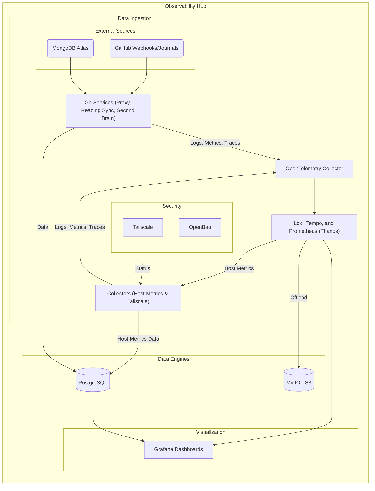

# Observability Hub

A resilient, self-hosted platform meticulously engineered to showcase advanced Site Reliability Engineering (SRE) and Platform Engineering principles. It delivers full-stack observability (Logs, Metrics, Traces), GitOps-driven infrastructure management, and standardized telemetry ingestion for complex cloud-native environments.

Built using Go and orchestrated on Kubernetes (K3s), the platform unifies system metrics, application events, and logs into a single queryable layer leveraging OpenTelemetry, PostgreSQL (TimescaleDB), Grafana Loki, Prometheus, and Grafana. It's designed for operational excellence, demonstrating how to build a robust, observable, and maintainable system from the ground up.

[Explore Live Telemetry & System Evolution](https://victoriacheng15.github.io/observability-hub/)

---

## 🚀 Key Achievements & Capabilities

This project highlights significant accomplishments in building a modern observability and platform engineering solution:

* **Full OpenTelemetry (LMT) Implementation:** Achieved end-to-end observability with a unified OTel Collector, Tempo (Traces), Prometheus (Metrics), Loki (Logs), and Go SDK for instrumentation. Includes Service Graphs, synthetic transaction monitoring, and comprehensive host-level telemetry.
* **GitOps Reconciliation Engine:** Implemented a secure, templated GitOps reconciliation engine for automated state enforcement via webhooks, scaled to support multi-tenant synchronization.
* **Kubernetes Migration & Cloud-Native Operations:** All core observability stack components (Loki, Grafana, Tempo, Prometheus, Postgres) are running natively in Kubernetes with persistent storage.
* **Library-First Architecture:** Structural transition into `pkg/` and `services/` layout, decoupling core business logic into transport-agnostic modules for improved reusability and testability.
* **Centralized Secrets Management:** Transitioned to OpenBao for secure secrets storage and retrieval, replacing insecure static configurations.
* **Hybrid Cloud Architecture (Store-and-Forward Bridge):** Designed and implemented a secure bridge for ingesting external telemetry without exposing local ports, ensuring reliable data flow from diverse sources.
* **Reproducible Local Development:** Ensures consistent and reproducible developer environments via `shell.nix` and `docker-compose`.
* **Formalized Decision-Making & Incident Response:** Established an Architectural Decision Record (ADR) process and an Incident Response/RCA framework for structured decision-making and operational excellence.
* **Unified Host Telemetry Collectors:** Deployed a resource-efficient `collectors` service, centralizing host-level data collection and optimizing processing.

---

## 📚 Further Documentation

For deeper insights into the project's structure and operational guides:

* **[Documentation Hub](./docs/README.md)**: Central entry point for Architecture, Decisions (ADRs), and Operational Notes.

---

## 🛠️ Tech Stack & Architecture

The platform leverages a robust set of modern technologies for its core functions:


### System Architecture Overview

The diagram below illustrates the high-level flow of telemetry data from collection to visualization, highlighting the hybrid orchestration model between host services and the Kubernetes data platform.



For a detailed breakdown of all implemented components and their responsibilities, please refer to the **[Project Summary](./PROJECT_SUMMARY.md)**.

---

## 🏗️ Engineering Principles

Foundational principles guide every aspect of the platform's development and operation:

* **Observability-First:** Full-stack visibility is foundational, with advanced telemetry signals implemented as a project standard.
* **Infrastructure Abstraction:** Decoupling plumbing from logic via shared "Pure Wrappers" to focus services on domain value.
* **GitOps & State Convergence:** Configuration as code with automated reconciliation, making version control the ultimate source of truth.
* **Hybrid Orchestration:** Leveraging Kubernetes for data persistence and native Systemd for host-level automation.

---

## 🚀 Getting Started (Local Development)

This guide will help you set up and run the `observability-hub` locally using **Kubernetes (K3s)**.

### Prerequisites

Ensure you have the following installed on your system:

* [Go](https://go.dev/doc/install) (version 1.25 or newer)
* [K3s](https://k3s.io/) (Lightweight Kubernetes)
* [Helm](https://helm.sh/)
* `make` (GNU Make)
* [Nix](https://nixos.org/download.html) (for reproducible toolchains)

### 1. Configuration

The project uses a `.env` file to manage environment variables, especially for database connections and API keys.

```bash
# Start by copying the example file
cp .env.example .env
```

You will need to edit the newly created `.env` file to configure connections for MongoDB Atlas, PostgreSQL (K3s NodePort), and other services.

### 2. Build and Run the Stack

The platform utilizes a hybrid orchestration model. You must deploy both the Kubernetes data tier and the native host services.

#### A. Data Infrastructure (K3s)

Deploy the observability backend into the `observability` namespace:

```bash
make k3s-postgres-up
make k3s-minio-up
make k3s-loki-up
make k3s-tempo-up
make k3s-prometheus-up
make k3s-grafana-up
make k3s-thanos-up

# Deploy telemetry collectors
make k3s-otel-up
```

#### B. Native Host Services

Build and initialize the automation and telemetry collectors on the host:

```bash
# Build Go binaries
make proxy-build
make reading-build

# Install and start Systemd services (requires sudo)
make install-services

# Run Second Brain sync manually
make brain-sync
```

### 3. Verification

Once the stack is running, you can verify the end-to-end telemetry flow:

* **Cluster Health:** Access Grafana at `http://localhost:30000` (NodePort).
* **Service Logs:** Check logs for host components via Grafana Loki.
* **Knowledge Sync:** Manually trigger a Second Brain ingestion with `make brain-sync`.

### 4. Managing the Cluster

To stop or remove resources, use the standard `kubectl delete` commands targeting the `observability` namespace.
