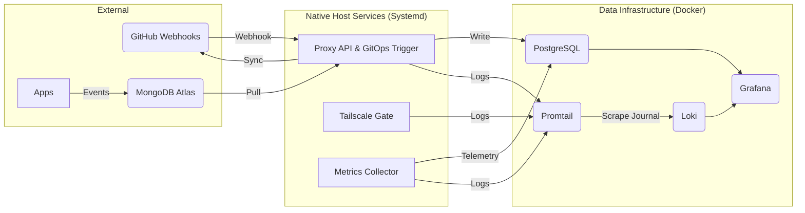

# Self-Hosted Observability Hub

A resilient and reliability-focused unified telemetry platform architected to demonstrate SRE & Platform Engineering principles: full-stack observability, GitOps-driven infrastructure, and standardized data ingestion. It unifies system metrics, application events, and logs into a single queryable layer using PostgreSQL (TimescaleDB) and Loki, visualized via Grafana.

---

## 🌐 Live Site

[Explore Live Telemetry & System Evolution](https://victoriacheng15.github.io/observability-hub/)

---

## 🏗️ Engineering Principles

- **Unified Observability:** Correlation of infrastructure telemetry and application business events into a single, queryable plane. Full-stack visibility is the default state, ensuring all services are observed via a consistent, unified standard.
- **Platform Abstraction:** Decoupling of data ingestion from storage engines. Standardized APIs provide stable interfaces for clients, allowing the underlying pipeline logic and database schemas to evolve without disrupting upstream producers.
- **GitOps & State Convergence:** Enforcement of configuration consistency between version control and the running environment. Automated reconciliation engines detect and correct drift, ensuring the "Source of Truth" is always the reality.
- **Hybrid Runtime Pragmatism:** Strategic deployment utilizing the most effective primitives for the task. Containerization provides isolation for stateless data services, while native host management (Systemd) is leveraged for performance-critical automation and hardware-level telemetry.

---

## 🛠️ Tech Stack


---

## 📚 Architectural Approach & Documentation

This section provides a deeper look into the system's structure, components, and data flow.

### System Architecture Diagram

This diagram shows the high-level flow of data from collection to visualization.



### Component Breakdown

This table lists the main services and components within the observability hub, along with their responsibilities and location within the repository.

| Service / Component | Responsibility | Location |
| :------------------ | :------------- | :------- |
| **proxy** | Native Go service acting as an API gateway, Data Pipeline engine, and **GitOps Webhook listener**. | `proxy/` |
| **tailscale-gate** | Security agent managing public access (Tailscale Funnel) based on Proxy health. | `scripts/` |
| **system-metrics** | Lightweight Go collector for host CPU, memory, disk, and network stats. | `system-metrics/` |
| **page** | Go static-site generator for the public-facing portfolio page. | `page/` |
| **PostgreSQL** | Primary time-series storage (TimescaleDB + PostGIS). | `docker-compose.yml` |
| **Grafana** | Primary visualization and dashboarding tool. | `docker-compose.yml` |
| **Loki** | Log aggregation system for all services. | `docker-compose.yml` |
| **Promtail** | Scrapes host (Journald) and container logs for delivery to Loki. | `docker-compose.yml` |
| **gitops-sync** | Reconciliation script triggered by the Proxy to enforce repository state. | `scripts/` |
| **reading-sync** | Systemd service that periodically triggers the `proxy` Data Pipeline. | `systemd/` |

### External Dependencies

These components exist outside this repository but are integral to the data pipeline:

| Dependency | Role |
| :--- | :--- |
| **Client Applications** | Sources of event data (e.g., Cover Craft, Personal Reading Analytics). |
| **MongoDB Atlas** | Interim cloud storage used as a buffer/queue for external event logs. |

### Data Flow

The system categorizes data flow into three main streams, correlating events, container health, and host stability.

1. **Application Events:**
    - **Source:** Client Applications (e.g., Cover Craft, Personal Reading Analytics Dashboard) write events to MongoDB Atlas.
    - **Process:** The reading-sync service (Systemd) triggers the proxy to fetch, transform, and persist records into PostgreSQL.
    - **Dashboard:** Reading Analytics.
2. **Docker Monitoring:**
    - **Source:** Containerized services (Proxy, PostgreSQL, Loki, Grafana).
    - **Collection:** Promtail scrapes container logs directly from the Docker socket.
    - **Dashboard:** Docker Monitoring.
3. **Systemd Monitoring:**
    - **Source:** Host services and hardware telemetry.
    - **Collection:** The system-metrics collector (automated via Systemd timer) flushes hardware stats to PostgreSQL, while Promtail scrapes journald for service logs.
    - **Dashboards:** Systemd Monitoring and Homelab (hardware metrics).

For deep dives into the system's inner workings:

- **[Detailed Architecture Docs](./docs/architecture/README.md)**: System context, component diagrams, and data flows.
- **[Decision Records](./docs/decisions/README.md)**: Architectural Decision Records (ADRs) explaining the "Why" behind key technical choices.

---

## 🚢 Deployment Strategy

The platform employs a Hybrid Deployment Model to balance security, reliability, and performance:

### 1. Event-Driven GitOps (Webhook-based)

Critical observability infrastructure and host configurations are managed by an automated reconciliation workflow.

- **Mechanism:** GitHub sends a **Webhook** event (Push or PR Merge) to the Proxy service.
- **Action:** The Proxy validates the request signature and executes the local `gitops_sync.sh` script to update the repository and reload services.
- **Benefit:** Real-time updates and improved security by ensuring the public entry point (via Tailscale Funnel) is managed dynamically based on system state.

### 2. Public Portfolio (Push-based CI/CD)

The static status page is built and deployed via GitHub Actions.

- **Mechanism:** Standard CI pipeline defined in `.github/workflows/deploy.yml`.
- **Action:** Builds the Go `page` generator and deploys the output to GitHub Pages.
- **Benefit:** Fast feedback loops and high availability for the public-facing component.

---

## 🚀 Getting Started (Local Development)

This guide will help you set up and run the `observability-hub` locally using Docker Compose.

### Prerequisites

Ensure you have the following installed on your system:

- [Go](https://go.dev/doc/install) (version 1.21 or newer)
- [Docker Desktop](https://www.docker.com/products/docker-desktop/) (includes Docker Compose)
- `make` (GNU Make)

### 1. Configuration

The project uses a `.env` file to manage environment variables, especially for database connections and API keys.

```bash
# Start by copying the example file
cp .env.example .env
```

You will need to edit the newly created `.env` file to configure connections for MongoDB Atlas, PostgreSQL, and other services as required.

### 2. Build and Run the Stack

Bring up all services defined in `docker-compose.yml` with a single command:

```bash
make up
```

This command will:

- Build all necessary Docker images for the Go services.
- Start and provision all containerized services (PostgreSQL, Grafana, Loki, Promtail).
- The `-d` flag runs the services in the background.

To view the logs of all running services:

```bash
docker compose logs -f
```

### 3. Verification

Once the services are up and running, you can verify their functionality:

- **Grafana Dashboards:** Access Grafana at `http://localhost:3001`.
  - Default login: `admin` / `grafana`
  - You should see your provisioned data sources and dashboards.
- **Static Portfolio Site:** The `page` service builds your public portfolio site into the `page/dist` directory. You can inspect the generated static HTML files there.

### 4. Stopping the Stack

To stop and remove all running services and their associated containers, volumes, and networks:

```bash
make down
```
