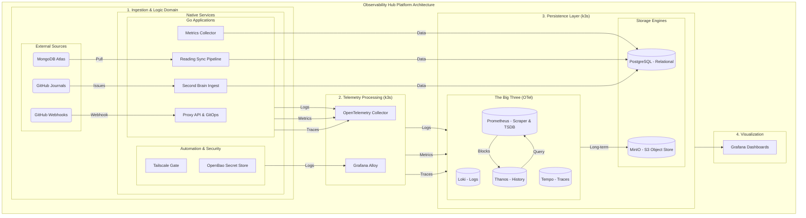

# Self-Hosted Observability Hub

A resilient and reliability-focused unified telemetry platform architected to demonstrate SRE & Platform Engineering principles: full-stack observability, GitOps-driven infrastructure, and standardized data ingestion. It unifies system metrics, application events, and logs into a single queryable layer using **PostgreSQL (TimescaleDB)** and **Grafana Loki**, visualized via **Grafana**, all orchestrated within a **Kubernetes (K3s)** environment.

---

## 🌐 Live Site

[Explore Live Telemetry & System Evolution](https://victoriacheng15.github.io/observability-hub/)

---

## 🏗️ Engineering Principles

- **Observability-First:** Full-stack visibility is foundational. Every service implements advanced signals (lag, saturation, pool health) as a project standard.
- **Infrastructure Abstraction:** Decoupling plumbing from logic. Shared "Pure Wrappers" handle connection and OTel complexity, allowing services to focus strictly on domain value.
- **GitOps & State Convergence:** Configuration as code with automated reconciliation. Version control is the ultimate source of truth for the environment state.
- **Hybrid Orchestration:** Utilizing Kubernetes for data persistence and native Systemd for host-level automation and high-performance telemetry.

---

## 🛠️ Tech Stack


---

## 📚 Architectural Approach & Documentation

This section provides a deeper look into the system's structure, components, and data flow.

### System Architecture Diagram

This diagram shows the high-level flow of data from collection to visualization, highlighting the hybrid orchestration between host services and the Kubernetes data platform.



### Component Breakdown

The platform is split into two logical layers: **Native Host Services** for automation and hardware-level telemetry, and **Data Infrastructure** for scalable storage and visualization.

#### Native Host Services

| Service / Component | Responsibility | Location |
| :------------------ | :------------- | :------- |
| **gitops-sync** | Reconciliation script for automated state enforcement. | `scripts/` |
| **openbao** | Centralized, encrypted secret storage and management. | `systemd/` |
| **page** | Go static-site generator for the public-facing portfolio page. | `page/` |
| **proxy** | API gateway and **GitOps Webhook listener**. | `services/proxy/` |
| **reading-sync** | Automated data pipeline syncing MongoDB data to local PostgreSQL. | `services/reading-sync/` |
| **second-brain** | Ingests atomic thoughts from GitHub journals into PostgreSQL. | `services/second-brain/` |
| **system-metrics** | Lightweight collector for host hardware telemetry (CPU, Mem, Disk, Net). | `services/system-metrics/` |
| **tailscale-gate** | Security agent managing public access (Tailscale Funnel) based on Proxy health. | `scripts/` |

#### Data Infrastructure (Kubernetes)

| Service / Component | Responsibility | Location |
| :------------------ | :------------- | :------- |
| **Grafana Alloy** | Unified telemetry agent for journal collection and K8s scraping. | `k3s/alloy/` |
| **Grafana** | Centralized visualization and dashboarding platform. | `k3s/grafana/` |
| **Grafana Loki** | Log aggregation and query system for the entire stack. | `k3s/loki/` |
| **MinIO** | S3-compatible object storage for long-term trace and log persistence. | `k3s/minio/` |
| **OpenTelemetry Collector** | Standalone collector for multi-signal telemetry routing. | `k3s/opentelemetry/` |
| **PostgreSQL** | Primary relational storage (TimescaleDB + PostGIS) for metrics and events. | `k3s/postgres/` |
| **Prometheus** | Metrics storage, service discovery, and alerting engine. | `k3s/prometheus/` |
| **Grafana Tempo** | Distributed tracing backend for request correlation. | `k3s/tempo/` |
| **Thanos Store** | Query gateway for historical metrics stored in MinIO. | `k3s/thanos/` |

### External Dependencies

These components exist outside this repository but are integral to the data pipeline:

| Dependency | Role |
| :--- | :--- |
| **Client Applications** | Sources of event data (e.g., Cover Craft, Personal Reading Analytics). |
| **GitHub** | Source of webhooks for GitOps and issues for knowledge ingestion. |
| **MongoDB Atlas** | Interim cloud storage used as a buffer/queue for external event logs. |

For deep dives into the system's inner workings, operational guides, and decision logs:

- **[Documentation Hub](./docs/README.md)**: Central entry point for Architecture, Decisions (ADRs), and Operational Notes.

---

## 🚀 Getting Started (Local Development)

This guide will help you set up and run the `observability-hub` locally using **Kubernetes (K3s)**.

### Prerequisites

Ensure you have the following installed on your system:

- [Go](https://go.dev/doc/install) (version 1.25 or newer)
- [K3s](https://k3s.io/) (Lightweight Kubernetes)
- [Helm](https://helm.sh/)
- `make` (GNU Make)
- [Nix](https://nixos.org/download.html) (for reproducible toolchains)

### 1. Configuration

The project uses a `.env` file to manage environment variables, especially for database connections and API keys.

```bash
# Start by copying the example file
cp .env.example .env
```

You will need to edit the newly created `.env` file to configure connections for MongoDB Atlas, PostgreSQL (K3s NodePort), and other services.

### 2. Build and Run the Stack

The platform utilizes a hybrid orchestration model. You must deploy both the Kubernetes data tier and the native host services.

#### A. Data Infrastructure (K3s)

Deploy the observability backend into the `observability` namespace:

```bash
# Deploy core data and telemetry services
make k3s-postgres-up
make k3s-loki-up
make k3s-tempo-up
make k3s-prometheus-up
make k3s-grafana-up

# Deploy telemetry collectors
make k3s-alloy-up
make k3s-otel-up
```

#### B. Native Host Services

Build and initialize the automation and telemetry collectors on the host:

```bash
# Build Go binaries
make proxy-build
make metrics-build
make reading-build

# Install and start Systemd services (requires sudo)
make install-services

# Run Second Brain sync manually
make brain-sync
```

### 3. Verification

Once the stack is running, you can verify the end-to-end telemetry flow:

- **Cluster Health:** Access Grafana at `http://localhost:30000` (NodePort).
- **Service Logs:** Check logs for host components using `journalctl -u proxy -f`.
- **System Metrics:** Verify hardware telemetry is reaching PostgreSQL via the Homelab dashboard.
- **Knowledge Sync:** Manually trigger a Second Brain ingestion with `make brain-sync`.

### 4. Managing the Cluster

To stop or remove resources, use the standard `kubectl delete` commands targeting the `observability` namespace.
