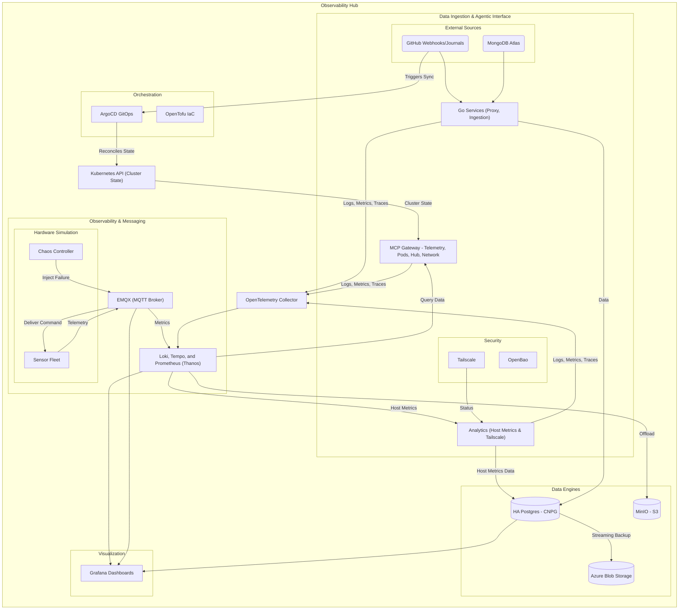

# Observability Hub

A resilient, self-hosted platform meticulously engineered to showcase advanced Site Reliability Engineering (SRE) and Platform Engineering principles. It delivers full-stack observability (Logs, Metrics, Traces), GitOps-driven infrastructure management, and standardized telemetry ingestion for complex cloud-native environments.

Built using Go and orchestrated on Kubernetes (K3s), the platform unifies system metrics, application events, and logs into a single queryable layer leveraging OpenTelemetry, High-Availability (HA) PostgreSQL via CloudNativePG (CNPG), Grafana Loki, Prometheus, and Grafana. It's designed for operational excellence, demonstrating how to build a robust, observable, and maintainable system from the ground up.

🌐 [Project Portal](https://victoriacheng15.github.io/observability-hub/)

📚 [Documentation Hub: Architecture, ADRs, Operations & Visual Gallery](./docs/README.md)

---

## 📚 Project Evolution

This platform evolved through intentional phases. See the full journey with ADRs:

[View Complete Evolution Log](https://victoriacheng15.github.io/observability-hub/evolution.html)

### Key Milestones

- **Ch 1-3: Foundations** – Docker lab, Shared Go libraries, and Host-level visibility.
- **Ch 4-6: Kubernetes Pivot** – Cluster migration, Event-driven GitOps, and Vault (OpenBao) security.
- **Ch 7-9: SRE & Maturity** – Full OpenTelemetry (LMT) stack, Library-first modularity, and OpenTofu/Terraform IaC.
- **Ch 10: MCP Era** – AI-native operations via a unified, domain-isolated Model Context Protocol gateway.
- **Ch 11: eBPF-Native Efficiency & Networking** – Kepler energy monitoring and Cilium eBPF-native networking for high-fidelity L7 visibility.
- **Ch 12: GitOps & Operational Maturity** – Centralized orchestration via ArgoCD and a layered infrastructure architecture.

---

## 🛠️ Tech Stack & Architecture

The platform leverages a robust set of modern technologies for its core functions:


### System Architecture Overview

The diagram below illustrates the high-level flow of telemetry data from collection to visualization, highlighting the hybrid orchestration model between host services and the Kubernetes data platform.


```mermaid
flowchart TB
    subgraph ObservabilityHub ["Observability Hub"]
        direction TB
        subgraph Logic ["Data Ingestion & Agentic Interface"]
            subgraph External ["External Sources"]
                GH(GitHub Webhooks/Journals)
                Mongo(MongoDB Atlas)
            end

            subgraph Security [Security]
                Bao[OpenBao]
                Tailscale[Tailscale]
            end

            GoApps["Go Services (Proxy, Ingestion)"]
            MCP["MCP Gateway - Telemetry, Pods, Hub, Network"]
            Analytics["Analytics (Host Metrics & Tailscale)"]
        end

        subgraph Control ["Orchestration"]
            GitOps[ArgoCD GitOps]
            Tofu[OpenTofu IaC]
        end

        K3S["Kubernetes API (Cluster State)"]
        OTEL[OpenTelemetry Collector]

        subgraph DataPlatform ["Observability & Messaging"]
            Observability["Loki, Tempo, and Prometheus (Thanos)"]
            EMQX["EMQX (MQTT Broker)"]
            subgraph Simulation ["Hardware Simulation"]
                Sensors["Sensor Fleet"]
                Chaos["Chaos Controller"]
            end
        end

        subgraph Storage ["Data Engines"]
            PG[(HA Postgres - CNPG)]
            S3[(MinIO - S3)]
            Azure[(Azure Blob Storage)]
        end
        

        subgraph Visualization ["Visualization"]
            Grafana[Grafana Dashboards]
        end
    end

    %% GitOps Loop
    GH -- "Triggers Sync" --> GitOps
    GitOps -- "Reconciles State" --> K3S

    %% Data Pipeline Connections
    GH --> GoApps
    Mongo --> GoApps
    
    %% Unified MCP Paths
    Observability -- "Query Data" --> MCP
    K3S -- "Cluster State" --> MCP

    %% Simulation & Chaos
    Chaos -- "Inject Failure" --> EMQX
    EMQX -- "Deliver Command" --> Sensors
    Sensors -- "Telemetry" --> EMQX
    EMQX -- "Metrics" --> Observability

    %% Telemetry & Storage Connections
    Observability -- "Host Metrics" --> Analytics
    Tailscale -- "Status" --> Analytics
    Analytics -- "Host Metrics Data" --> PG
    GoApps -- Data --> PG

    %% Telemetry Pipeline (OTLP)
    GoApps & MCP & Analytics -- "Logs, Metrics, Traces" --> OTEL
    OTEL --> Observability
    
    %% Resilience & Backup
    Observability -- "Offload" --> S3
    PG -- "Streaming Backup" --> Azure

    %% Visualization Connections
    Observability & PG & EMQX --> Grafana
```

---

## 🚀 Key Achievements & Capabilities

### ☸️ Platform Engineering & Infrastructure

- **High-Availability Data Tier:** Deployed Loki, Tempo, and Thanos on Kubernetes with CloudNativePG for automated PostgreSQL failover and Azure Blob Storage for off-cluster backups.
- **GitOps Orchestration:** Centralized cluster lifecycle management via ArgoCD, using an `App-of-Apps` pattern to maintain declarative state and automated self-healing.
- **Layered IaC:** Implemented a domain-isolated OpenTofu architecture (00-09) to decouple foundation, networking, and application tiers for high-fidelity maintainability.
- **Secrets Orchestration:** Integrated OpenBao to replace static environment variables with dynamic, on-demand credential retrieval.

### 🏗️ Software Architecture & Design

- **Dependency Consolidation:** Unified fragmented Go modules into a single monorepo, removing 17 `replace` directives.
- **Architectural Isolation:** Implemented `Thin Main` patterns and strict `internal/` package scoping to decouple domain logic from infrastructure plumbing.
- **GitOps Engine:** Built a custom HMAC-secured webhook listener to trigger automated repository state reconciliation across the cluster.

### 🔭 Observability & Agentic Intelligence

- **Full-Stack Telemetry:** Standardized on OpenTelemetry (Logs, Metrics, Traces) for unified signal correlation across host and Kubernetes services.
- **Agentic Interface (MCP):** Implemented a unified Model Context Protocol gateway to expose system state to AI agents, using domain isolation to enforce platform security.
- **Store-and-Forward Bridge:** Built a secure telemetry relay to ingest host-level data into Kubernetes without exposing internal cluster ports.

### 📋 Operational Governance

- **Decision Framework:** Adopted Architectural Decision Records (ADRs) and Incident RCA templates to document system evolution and manage technical debt.

---

## 🚀 Getting Started

<details>
<summary><b>Local Development Guide</b></summary>

This guide will help you set up and run the `observability-hub` locally using Kubernetes (K3s).

### Prerequisites

Ensure you have the following installed on your system:

- [Go](https://go.dev/doc/install)
- [K3s](https://k3s.io/) (Lightweight Kubernetes)
- [Helm](https://helm.sh/)
- `make` (GNU Make)
- [Nix](https://nixos.org/download.html) (for reproducible toolchains)

### 1. Configuration

The project uses a `.env` file to manage environment variables, especially for database connections and API keys.

```bash
# Start by copying the example file
cp .env.example .env
```

You will need to edit the newly created `.env` file to configure connections for MongoDB Atlas, PostgreSQL (K3s NodePort), and other services.

### 2. Build and Run the Stack

The platform utilizes a hybrid orchestration model. You must deploy both the Kubernetes data tier and the native host services.

#### A. Data Infrastructure (K3s)

Deploy the observability backend using OpenTofu (IaC):

```bash
cd tofu
tofu init
tofu apply
```

This will provision PostgreSQL, MinIO, Loki, Tempo, Prometheus, Thanos, Grafana, and the OpenTelemetry Collector in the `observability` namespace.

For the **Analytics** service (which uses a custom local image), use the Makefile target:

```bash
make k3s-analytics-up
```

#### B. Native Host Services

Build and initialize the automation and telemetry analytics on the host:

```bash
# Build Go binaries
make proxy-build
make ingestion-build
make mcp-build

# Install and start Systemd services (requires sudo)
make install-services
```

### 3. Verification

Once the stack is running, you can verify the end-to-end telemetry flow:

- **Cluster Health:** Access Grafana at `http://localhost:30000` (NodePort).
- **Service Logs:** Check logs for host components via Grafana Loki.

### 4. Managing the Cluster

To stop or remove resources, use the standard `kubectl delete` commands targeting the `observability` namespace.

</details>
