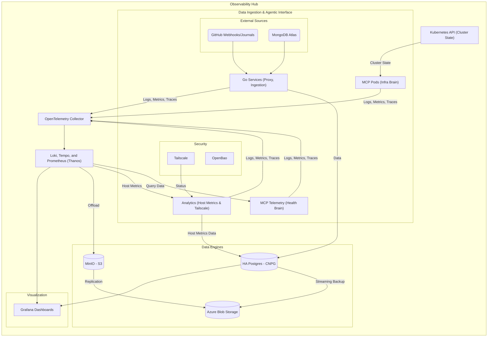

# Observability Hub

A resilient, self-hosted platform meticulously engineered to showcase advanced Site Reliability Engineering (SRE) and Platform Engineering principles. It delivers full-stack observability (Logs, Metrics, Traces), GitOps-driven infrastructure management, and standardized telemetry ingestion for complex cloud-native environments.

Built using Go and orchestrated on Kubernetes (K3s), the platform unifies system metrics, application events, and logs into a single queryable layer leveraging OpenTelemetry, High-Availability (HA) PostgreSQL via CloudNativePG (CNPG), Grafana Loki, Prometheus, and Grafana. It's designed for operational excellence, demonstrating how to build a robust, observable, and maintainable system from the ground up.

[Explore Live Telemetry & System Evolution](https://victoriacheng15.github.io/observability-hub/)

---

## 🚀 Key Achievements & Capabilities

### ☸️ Cloud-Native & Platform Engineering
* **Kubernetes Migration & HA Operations:** Core observability and data components (Loki, Grafana, Tempo, Prometheus, CNPG) run natively in Kubernetes, leveraging **CloudNativePG** for automated failover and **Azure Blob Storage** for durable backups.
* **GitOps Reconciliation Engine:** Implemented a secure, templated engine for automated state enforcement via HMAC-secured webhooks, enabling high-fidelity synchronization across environments.
* **Centralized Secrets Management:** Integrated **OpenBao** for secure, dynamic credential retrieval, eliminating insecure static configurations across all service layers.

### 🏗️ Software Architecture & Development
* **Unified Go Monorepo:** Consolidated fragmented modules into a single root module, eliminating 17 `replace` directives and standardizing dependency management across the entire stack.
* **Encapsulated Design Pattern:** Adopts an `internal/` and `cmd/` layout to enforce strict package visibility and the "Thin Main" pattern for enhanced system integrity and testability.
* **Reproducible Engineering Environment:** Ensures consistent developer environments via **Nix (`shell.nix`)** and Docker, minimizing environment friction and ensuring build reproducibility.

### 🔭 Observability & Agentic Intelligence
* **Full OpenTelemetry (LMT) Stack:** Achieved end-to-end visibility (Logs, Metrics, Traces) with a unified OTel Collector, Tempo, Prometheus, Loki, and custom Go SDK instrumentation.
* **Domain-Isolated MCP Interface:** A hardened "Agentic Interface" for AI agents, strictly decoupling infrastructure investigations (`mcp-pods`) from telemetry pipelines (`mcp-telemetry`) to enforce Least Privilege.
* **Hybrid Host-to-Cluster Bridge:** Designed a secure store-and-forward bridge for ingesting external telemetry and host analytics into the Kubernetes data tier without exposing local ports.

### 📋 Operational Governance
* **Formalized Decision Framework:** Established Architectural Decision Records (ADRs) and an Incident Response/RCA framework to ensure structured, traceable growth and operational excellence.

---

## 📚 Further Documentation

For deeper insights into the project's structure and operational guides:

* **[Documentation Hub](./docs/README.md)**: Central entry point for Architecture, Decisions (ADRs), and Operational Notes.

---

## 🛠️ Tech Stack & Architecture

The platform leverages a robust set of modern technologies for its core functions:


### System Architecture Overview

The diagram below illustrates the high-level flow of telemetry data from collection to visualization, highlighting the hybrid orchestration model between host services and the Kubernetes data platform.


```mermaid
flowchart TB
    subgraph ObservabilityHub ["Observability Hub"]
        direction TB
        subgraph Logic ["Data Ingestion & Agentic Interface"]
            subgraph External ["External Sources"]
                GH(GitHub Webhooks/Journals)
                Mongo(MongoDB Atlas)
            end

            subgraph Security [Security]
                Bao[OpenBao]
                Tailscale[Tailscale]
            end

            GoApps["Go Services (Proxy, Ingestion)"]
            MCP_Tele["MCP Telemetry (Health Brain)"]
            MCP_Pods["MCP Pods (Infra Brain)"]
            Analytics["Analytics (Host Metrics & Tailscale)"]
        end

        K8S["Kubernetes API (Cluster State)"]
        OTEL[OpenTelemetry Collector]

        Observability["Loki, Tempo, and Prometheus (Thanos)"]
        subgraph Storage ["Data Engines"]
            PG[(HA Postgres - CNPG)]
            S3[(MinIO - S3)]
            Azure[(Azure Blob Storage)]
        end
        

        subgraph Visualization ["Visualization"]
            Grafana[Grafana Dashboards]
        end
    end

    %% Data Pipeline Connections
    GH --> GoApps
    Mongo --> GoApps
    
    %% Domain-Isolated MCP Paths
    Observability -- "Query Data" --> MCP_Tele
    K8S -- "Cluster State" --> MCP_Pods

    %% Telemetry & Storage Connections
    Observability -- "Host Metrics" --> Analytics
    Tailscale -- "Status" --> Analytics
    Analytics -- "Host Metrics Data" --> PG
    GoApps -- Data --> PG

    %% Telemetry Pipeline (OTLP)
    GoApps & MCP_Tele & MCP_Pods & Analytics -- "Logs, Metrics, Traces" --> OTEL
    OTEL --> Observability
    
    %% Resilience & Backup
    Observability -- "Offload" --> S3
    PG -- "Streaming Backup" --> Azure
    S3 -- "Replication" --> Azure

    %% Visualization Connections
    Observability & PG --> Grafana
```

---

## 🏗️ Engineering Principles

Foundational principles guide every aspect of the platform's development and operation:

* **Signals over Noise:** Standardizing telemetry signals to provide immediate clarity on service behavior across the entire stack.
* **Logic over Plumbing:** Decoupling infrastructure boilerplate from service logic using shared Go wrappers to focus on domain value.
* **Config as the Truth:** Using GitOps to ensure version control remains the ultimate source of truth, with automated state reconciliation.
* **Pragmatic Orchestration:** Leveraging Kubernetes for persistence and native Systemd for host automation to maximize reliability with minimal overhead.

---

## 🚀 Getting Started (Local Development)

This guide will help you set up and run the `observability-hub` locally using **Kubernetes (K3s)**.

### Prerequisites

Ensure you have the following installed on your system:

* [Go](https://go.dev/doc/install)
* [K3s](https://k3s.io/) (Lightweight Kubernetes)
* [Helm](https://helm.sh/)
* `make` (GNU Make)
* [Nix](https://nixos.org/download.html) (for reproducible toolchains)

### 1. Configuration

The project uses a `.env` file to manage environment variables, especially for database connections and API keys.

```bash
# Start by copying the example file
cp .env.example .env
```

You will need to edit the newly created `.env` file to configure connections for MongoDB Atlas, PostgreSQL (K3s NodePort), and other services.

### 2. Build and Run the Stack

The platform utilizes a hybrid orchestration model. You must deploy both the Kubernetes data tier and the native host services.

#### A. Data Infrastructure (K3s)

Deploy the observability backend using OpenTofu (IaC):

```bash
cd tofu
tofu init
tofu apply
```

This will provision PostgreSQL, MinIO, Loki, Tempo, Prometheus, Thanos, Grafana, and the OpenTelemetry Collector in the `observability` namespace.

For the **Analytics** service (which uses a custom local image), use the Makefile target:

```bash
make k3s-analytics-up
```

#### B. Native Host Services

Build and initialize the automation and telemetry analytics on the host:

```bash
# Build Go binaries
make proxy-build
make ingestion-build

# Install and start Systemd services (requires sudo)
make install-services
```

### 3. Verification

Once the stack is running, you can verify the end-to-end telemetry flow:

* **Cluster Health:** Access Grafana at `http://localhost:30000` (NodePort).
* **Service Logs:** Check logs for host components via Grafana Loki.

### 4. Managing the Cluster

To stop or remove resources, use the standard `kubectl delete` commands targeting the `observability` namespace.
