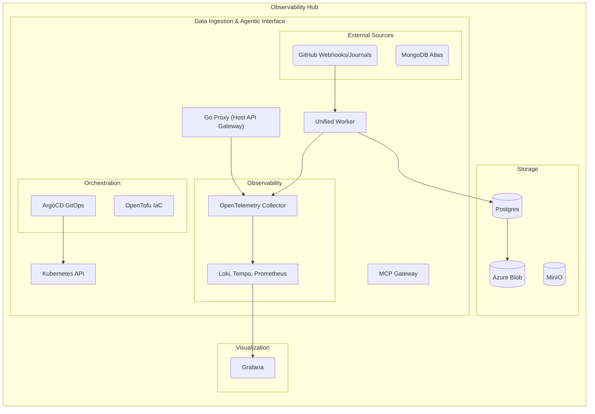

# Observability Hub

## What is this?

This is a self-hosted Kubernetes platform built on my homelab.

It demonstrates how a real DevOps / Platform Engineering team would:
- deploy applications using GitOps (Argo CD)
- collect logs, metrics, and traces using OpenTelemetry
- monitor systems with Grafana, Prometheus, and Loki
- manage infrastructure using OpenTofu (Terraform)
- handle failures with high-availability databases and backups

The goal is to simulate a production-like environment and show how to build a reliable, observable system from scratch.

- 🌐 [Project Portal](https://victoriacheng15.github.io/observability-hub/)  
- 📚 [Full Documentation & Visual Gallery](./docs/README.md)

---

## 🔍 What I Built (Quick Proof)

- Kubernetes (K3s) homelab running 10+ platform components
- GitOps deployment using Argo CD (App-of-Apps pattern)
- Full observability: logs, metrics, traces (OpenTelemetry + Grafana stack)
- High-availability PostgreSQL with automated failover (CloudNativePG)
- Centralized dashboards for monitoring and debugging
- Secrets management without hardcoding credentials
- Infrastructure as Code using OpenTofu (layered architecture)
- Data ingestion pipeline with worker-based processing
- eBPF-based networking and visibility using Cilium
- Backup and storage integration with Azure Blob + MinIO

---

## 📦 Platform Projects

This platform is built as a collection of smaller DevOps projects:

1. **GitOps Deployment (Argo CD)**
   - Declarative cluster management with self-healing

2. **Observability Stack**
   - Prometheus, Grafana, Loki, Tempo dashboards and alerts

3. **Telemetry Pipeline**
   - OpenTelemetry for logs, metrics, and traces

4. **High Availability Database**
   - PostgreSQL with failover and Azure Blob backups

5. **Secrets Management**
   - Dynamic secrets using OpenBao

6. **Infrastructure as Code**
   - OpenTofu layered architecture (00–09 separation)

7. **Networking with Cilium**
   - eBPF-based observability and traffic control

8. **CI/CD + GitOps Flow**
   - Webhook-triggered deployments and reconciliation

9. **Failure Simulation**
   - Chaos testing and system recovery

10. **Data Ingestion Pipeline**
   - Worker-based batch processing system

---

## 🧠 Problems I Solved

- Manual deployments → replaced with GitOps automation
- No visibility into systems → added logs, metrics, and tracing
- Secrets stored in code → moved to dynamic secret management
- Single point of failure → implemented HA database and backups
- Hard to debug issues → centralized dashboards and alerts
- Infrastructure drift → enforced declarative state with Argo CD

---

## 🛠️ Tech Stack

**Platform & Infrastructure**
- Kubernetes (K3s), Helm, Docker
- Argo CD (GitOps)
- OpenTofu (Terraform alternative)

**Observability**
- OpenTelemetry
- Prometheus, Grafana
- Loki (logs), Tempo (traces), Thanos (metrics scaling)

**Data & Storage**
- PostgreSQL (CloudNativePG)
- MinIO (S3-compatible)
- Azure Blob Storage

**Networking & Security**
- Cilium (eBPF networking)
- OpenBao (Secrets Management)
- Tailscale

**Languages**
- Go (backend services)

---

## 🏗️ System Architecture

The diagram below shows how telemetry flows through the system and how components interact.


```mermaid
flowchart TB
    subgraph ObservabilityHub ["Observability Hub"]
        direction TB
        subgraph Logic ["Data Ingestion & Agentic Interface"]
            subgraph External ["External Sources"]
                Mongo(MongoDB Atlas)
                GH(GitHub Webhooks/Journals)
            end

            subgraph Control ["Orchestration"]
                GitOps[ArgoCD GitOps]
                Tofu[OpenTofu IaC]
            end

            Proxy["Go Proxy (Host API Gateway)"]
            MCP["MCP Gateway"]
            Worker["Unified Worker"]
            K3S["Kubernetes API"]

            subgraph DataPlatform ["Observability"]
                OTEL[OpenTelemetry Collector]
                Observability["Loki, Tempo, Prometheus"]
            end
        end

        subgraph Storage ["Storage"]
            PG[(Postgres)]
            S3[(MinIO)]
            Azure[(Azure Blob)]
        end

        subgraph Visualization ["Visualization"]
            Grafana[Grafana]
        end
    end

    GitOps --> K3S
    GH --> Worker
    Proxy & Worker --> OTEL
    OTEL --> Observability
    Observability --> Grafana
    Worker --> PG
    PG --> Azure
```

---

## ⚠️ Challenges

One challenge was debugging service communication with Cilium networking.

- **Problem:** Services were unreachable even though pods were running  
- **Cause:** Incorrect network policies blocking traffic  
- **Fix:** Used logs and metrics to identify dropped packets and corrected policies  

---

## 🚀 Project Evolution

This platform evolved through multiple phases:

- **Foundations:** Docker, Go services, host-level visibility  
- **Kubernetes Migration:** Moved workloads to K3s + GitOps  
- **SRE Maturity:** Full observability (logs, metrics, traces)  
- **Infrastructure:** OpenTofu layered architecture  
- **Advanced Networking:** Cilium (eBPF)  
- **Operational Maturity:** Argo CD orchestration + HA systems  

👉 [View Full Evolution Log](https://victoriacheng15.github.io/observability-hub/evolution.html)

---

## 🚀 Getting Started

<details>
<summary><b>Local Setup</b></summary>

### Prerequisites
- Go
- K3s
- Helm
- Make
- Nix

### Setup

```bash
cp .env.example .env
```

### Deploy Infrastructure

```bash
cd tofu
tofu init
tofu apply
```

### Run Services

```bash
make proxy-build
make mcp-build
make install-services
```

### Verify

- Grafana: http://localhost:30000  
- Check logs via Loki  

</details>

---

## 📌 Summary

This project demonstrates how to build a production-like DevOps platform using:

- Kubernetes + GitOps  
- Full observability (logs, metrics, traces)  
- Infrastructure as Code  
- High availability systems  
- Real-world debugging and failure handling  

It reflects how modern platform teams operate in real environments.