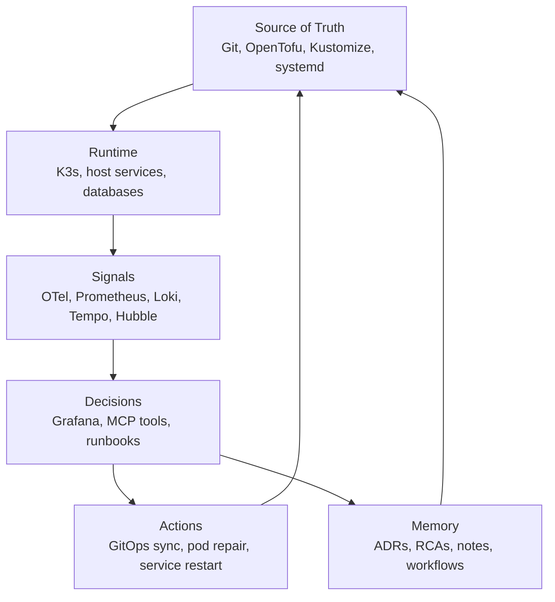

# Observability Hub

## What is this?

Observability Hub is an end-to-end infrastructure platform for a self-hosted Kubernetes environment.

The project is designed from source of truth to runtime operations: infrastructure definition, deployment automation, runtime observability, incident diagnosis, safe remediation, and operational memory.

Git and infrastructure definitions describe the intended state. Host and cluster runtimes execute that state. Telemetry systems expose behavior. MCP tools and dashboards support diagnosis. Remediation flows apply controlled fixes. ADRs, RCAs, and notes preserve what was learned.

- provision infrastructure declaratively
- deploy services through GitOps
- collect logs, metrics, traces, and network signals
- diagnose failures with dashboards, runbooks, and MCP tools
- analyze resource utilization, capacity pressure, and efficiency trends
- remediate safely through bounded operational paths
- preserve decisions and incidents as operational memory

The core loop is:


```mermaid
flowchart TB
    Source["Source of Truth<br/>Git, OpenTofu, Kustomize, systemd"]
    Runtime["Runtime<br/>K3s, host services, databases"]
    Signals["Signals<br/>OTel, Prometheus, Loki, Tempo, Hubble"]
    Decisions["Decisions<br/>Grafana, MCP tools, runbooks"]
    Actions["Actions<br/>GitOps sync, pod repair, service restart"]
    Memory["Memory<br/>ADRs, RCAs, notes, workflows"]

    Source --> Runtime
    Runtime --> Signals
    Signals --> Decisions
    Decisions --> Actions
    Actions --> Source
    Decisions --> Memory
    Memory --> Source
```

- 🌐 [Project Portal](https://victoriacheng15.github.io/observability-hub/)  

---

## 🔍 What This Builds (Quick Proof)

- Kubernetes (K3s) homelab running 10+ platform components
- GitOps deployment using Argo CD (App-of-Apps pattern)
- Full observability: logs, metrics, traces (OpenTelemetry + Grafana stack)
- Agent-readable operations through MCP tools for telemetry, pods, host health, and network flows
- High-availability PostgreSQL with automated failover (CloudNativePG)
- Centralized dashboards for monitoring and debugging
- Secrets management without hardcoding credentials
- Trivy-backed container and Kubernetes manifest hardening
- Infrastructure as Code using OpenTofu (layered architecture)
- Resource and capacity analysis using Kubernetes, host, and telemetry signals
- Data ingestion pipeline with worker-based processing
- eBPF-based networking and visibility using Cilium
- Backup and storage integration with Azure Blob Storage + MinIO

---

## 📦 Platform Projects

This platform is built as connected ownership domains:

| Domain | What It Proves |
| :--- | :--- |
| GitOps Deployment | Declarative cluster management with Argo CD self-healing |
| Observability Stack | Prometheus, Grafana, Loki, Tempo dashboards and alerts |
| Telemetry Pipeline | OpenTelemetry logs, metrics, and traces across services |
| High Availability Database | PostgreSQL failover with Azure Blob Storage backups |
| Secrets Management | Dynamic secrets and policy management with OpenBao |
| Workload Security | Trivy-scanned Dockerfiles and Kubernetes security contexts |
| Infrastructure as Code | Layered OpenTofu architecture for infrastructure ownership |
| Networking | Cilium eBPF visibility, policy control, and flow debugging |
| CI/CD | GitHub Actions, image publication, and GitOps reconciliation |
| Incident Response | Diagnostics, bounded repair actions, RCAs, and runbooks |
| Resource Efficiency | Kubernetes and host telemetry used for capacity and cost-aware analysis |
| Data Ingestion | Worker-based batch processing and analytics jobs |

---

## 🧠 Problems Solved

| Problem | Solution |
| :--- | :--- |
| Manual deployments | GitOps automation with Argo CD and webhook-triggered reconciliation |
| No visibility into systems | Logs, metrics, traces, network flows, and Grafana dashboards |
| Secrets stored in code | Dynamic secret management with OpenBao |
| Containers running with weak defaults | Non-root images, read-only root filesystems, dropped capabilities, and Trivy scans |
| Single point of failure | High-availability PostgreSQL and backup paths |
| Hard-to-debug issues | MCP diagnostics, dashboards, runbooks, and incident reports |
| Infrastructure drift | Declarative source of truth with OpenTofu, Kustomize, and GitOps |
| Unclear resource pressure | Kubernetes, host, and workload telemetry correlated for capacity decisions |
| Operational knowledge loss | Versioned ADRs, RCAs, notes, and workflow docs |

---

## Documentation Map

| Area | Purpose |
| :--- | :--- |
| [Full Documentation](./docs/README.md) | Central docs index |
| [Architecture](./docs/architecture/README.md) | System design and service boundaries |
| [Ownership Model](./docs/architecture/ownership.md) | End-to-end operating model for the platform |
| [ADRs](./docs/decisions/README.md) | Architecture decisions and tradeoffs |
| [RCAs](./docs/incidents/README.md) | Incidents, failures, and recovery notes |
| [Operations Notes](./docs/notes/README.md) | Runbooks and implementation notes |
| [Workflows](./docs/workflows.md) | CI/CD and GitOps workflow reality |
| [Visual Gallery](./docs/visual/README.md) | Dashboards and platform screenshots |

---

## 🛠️ Tech Stack

### Platform & Infrastructure

- Kubernetes (K3s), Helm, Docker
- Argo CD (GitOps)
- OpenTofu (Terraform alternative)

### Observability

- OpenTelemetry
- Prometheus, Grafana
- Loki (logs), Tempo (traces), Thanos (metrics scaling)

### Data & Storage

- PostgreSQL (CloudNativePG)
- MinIO (S3-compatible)
- Azure Blob Storage

### Networking & Security

- Cilium (eBPF networking)
- OpenBao (Secrets Management)
- Tailscale
- Trivy (container and Kubernetes misconfiguration scanning)

### Languages

- Go (backend services)

---

## ⚠️ Challenges

One challenge was debugging service communication with Cilium networking.

- **Problem:** Services were unreachable even though pods were running  
- **Cause:** Incorrect network policies blocking traffic  
- **Fix:** Used logs and metrics to identify dropped packets and corrected policies  

---

## 🚀 Project Evolution

This platform evolved through multiple phases:

- **Foundations:** Docker, Go services, host-level visibility  
- **Kubernetes Migration:** Moved workloads to K3s + GitOps  
- **SRE Maturity:** Full observability (logs, metrics, traces)  
- **Infrastructure:** OpenTofu layered architecture  
- **Advanced Networking:** Cilium (eBPF)  
- **Operational Maturity:** Argo CD orchestration + HA systems  

👉 [View Full Evolution Log](https://victoriacheng15.github.io/observability-hub/evolution.html)

---

## 🚀 Getting Started

<details>
<summary><b>Local Setup</b></summary>

### Prerequisites

- Go
- K3s
- Helm
- Make
- Nix

### Setup

```bash
cp .env.example .env
```

### Deploy Infrastructure

```bash
cd tofu
tofu init
tofu apply
```

### Run Services

```bash
make proxy-build
make mcp-build
make install-services
```

### Verify

- Grafana: <http://localhost:30000>  
- Check logs via Loki  

</details>

---

## 📌 Summary

This project demonstrates how to build a production-like DevOps platform using:

- Kubernetes + GitOps  
- Full observability (logs, metrics, traces)  
- Infrastructure as Code  
- Trivy-verified workload hardening
- High availability systems  
- Capacity and cost-aware infrastructure analysis  
- Real-world debugging and failure handling  

It reflects practical infrastructure ownership: designing the system, running it, observing it, debugging it, and using telemetry to make better operational and cost-aware decisions.
