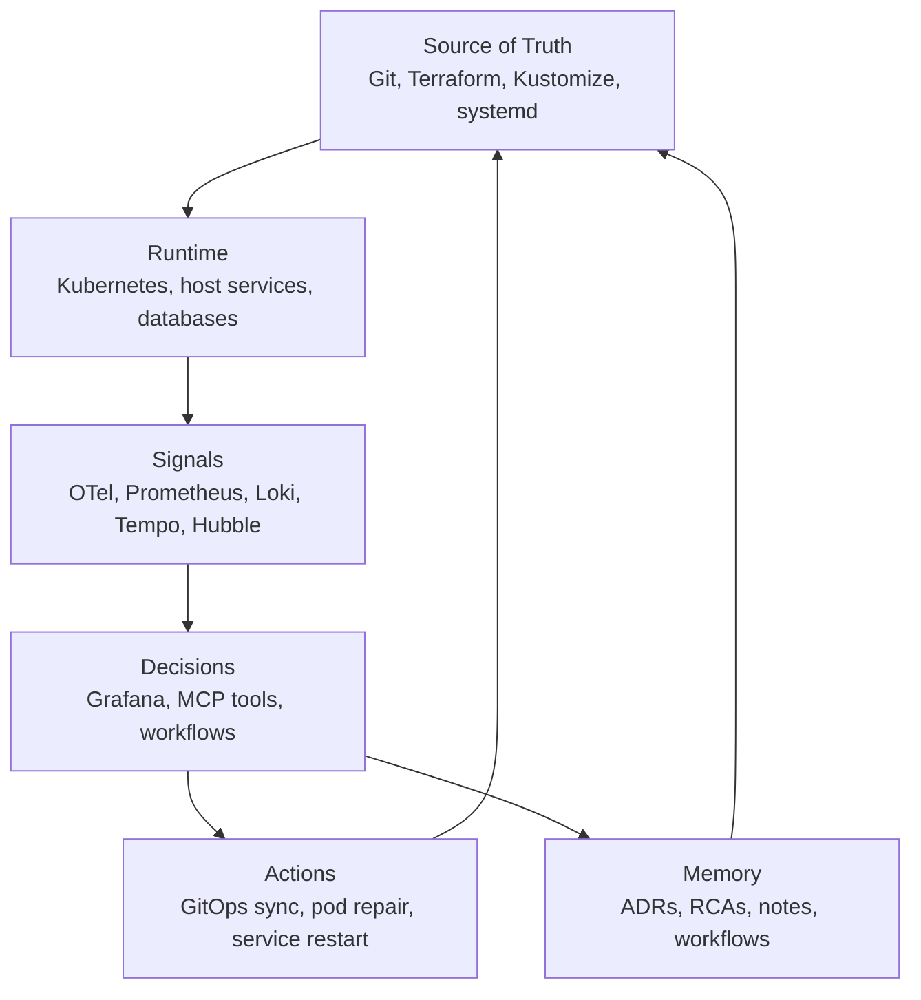

# Observability Hub

Observability Hub is a self-hosted platform engineering lab built with Kubernetes, Argo CD, OpenTofu (Terraform-compatible), OpenTelemetry, Grafana, Loki, Tempo, Prometheus, Cilium/Hubble, OpenBao, and Go services.

It proves an end-to-end platform ownership loop: declarative infrastructure runs host and cluster services, telemetry exposes behavior, operators and agents diagnose issues, bounded remediation applies fixes, and ADRs/RCAs preserve operational memory.

[Project Portal](https://victoriacheng15.github.io/observability-hub/) | [Full Documentation](./docs/README.md)

---

## Highlights

| Area | What it demonstrates |
| :--- | :--- |
| Platform orchestration | Systemd handles host-tier control while Kubernetes runs scalable data services |
| GitOps delivery | Argo CD reconciles cluster manifests and Proxy webhooks trigger host sync |
| Observability | OpenTelemetry, Grafana, Loki, Tempo, Prometheus, and Hubble correlate logs, metrics, traces, and network flows |
| Agent operations | MCP tools expose telemetry queries, pod inspection, host health, network flows, and bounded repair actions |
| Data durability | CloudNativePG, MinIO, and Azure backup paths support persistent platform state |
| Security | OpenBao, Trivy checks, Kubernetes security contexts, and Cilium policies reduce secret and workload risk |
| Operational memory | ADRs, incident reports, notes, workflows, and ownership docs preserve decisions and recovery paths |

---

## Architecture

The main system flow starts from declarative source, runs through host and cluster runtimes, emits telemetry, drives diagnosis, and feeds remediations and lessons back into source control.

| Path | Use case | Flow |
| :--- | :--- | :--- |
| Platform reconciliation | Keep host and cluster state aligned with Git | Git/Terraform/Kustomize/systemd -> Argo CD/Proxy -> Kubernetes/systemd runtime |
| Telemetry pipeline | Capture behavior across services and infrastructure | Go services/Kubernetes/Cilium -> OpenTelemetry/Prometheus/Loki/Tempo/Hubble -> Grafana/MCP |
| Agent diagnosis | Let operators query and repair live systems through bounded tools | MCP Hub -> telemetry/pod/host/network providers -> diagnosis or controlled remediation |
| Batch analytics | Convert runtime metrics and ingestion inputs into stored operational insight | Worker CronJobs -> Prometheus/Postgres/OpenBao -> analytics and ingestion records |
| Operational memory | Preserve the reasoning behind decisions and failures | Workflows/incidents -> ADRs/RCAs/notes -> future source changes |


```mermaid
flowchart TB
    Source["Source of Truth<br/>Git, Terraform, Kustomize, systemd"]
    Runtime["Runtime<br/>Kubernetes, host services, databases"]
    Signals["Signals<br/>OTel, Prometheus, Loki, Tempo, Hubble"]
    Decisions["Decisions<br/>Grafana, MCP tools, workflows"]
    Actions["Actions<br/>GitOps sync, pod repair, service restart"]
    Memory["Memory<br/>ADRs, RCAs, notes, workflows"]

    Source --> Runtime
    Runtime --> Signals
    Signals --> Decisions
    Decisions --> Actions
    Actions --> Source
    Decisions --> Memory
    Memory --> Source
```

---

## Tech Stack

| Layer | Tools |
| :--- | :--- |
| Language | Go |
| Infrastructure | Kubernetes, Terraform, Helm, Docker, systemd, Argo CD |
| Data stores | PostgreSQL/CloudNativePG, MinIO, Azure Blob Storage |
| Observability | OpenTelemetry, Grafana, Loki, Tempo, Prometheus, Cilium/Hubble |
| Security | OpenBao, Trivy, Tailscale |
| Testing | Go `testing` package, table-driven tests |
| CI/CD | GitHub Actions, Argo CD, GitOps webhook reconciliation |

---

## Documentation

- [Architecture](./docs/architecture/README.md)
- [Ownership Model](./docs/architecture/ownership.md)
- [Deployment](./docs/architecture/infrastructure/deployment.md)
- [Observability](./docs/architecture/core-concepts/observability.md)
- [Security](./docs/architecture/infrastructure/security.md)
- [Decisions](./docs/decisions/README.md)
- [Incidents](./docs/incidents/README.md)
- [Operations and CI/CD](./docs/workflows.md)

---

## Local Setup

```bash
cp .env.example .env
make web-build
make proxy-build
make mcp-build
```

Run checks:

```bash
make test
make lint
make lint-configs
```

Plan infrastructure:

```bash
cd tofu
tofu init
tofu plan
```
