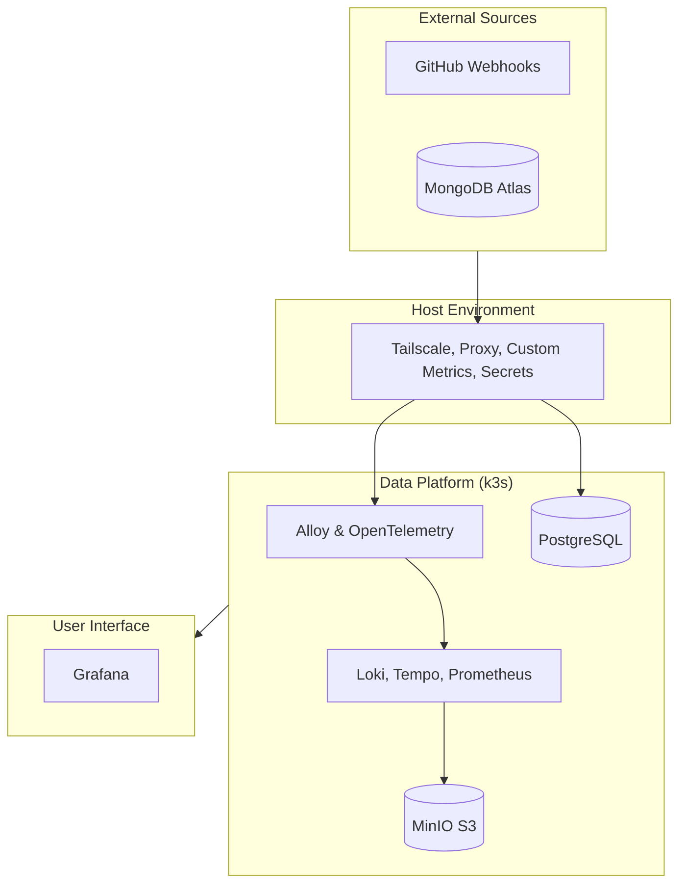

# Observability Hub Architecture

This directory contains the detailed architectural blueprints for the Observability Hub. The system follows a hybrid model, utilizing **Kubernetes (k3s)** for core data services and native Systemd units for host-level automation and data pipelines.

## 🗺️ System Context

The hub integrates standard observability tools with custom Go services to provide a resilient, self-healing telemetry platform orchestrated via Kubernetes.

---

## 📂 Documentation Domains

### 🧠 [Core Concepts](./core-concepts/)

Fundamental patterns and cross-cutting concerns that define how the system operates.

- **[Automation & GitOps](./core-concepts/automation.md)**: Webhook-driven reconciliation and self-healing patterns.
- **[Observability](./core-concepts/observability.md)**: Standards for JSON logging, Journald integration, and Alloy pipelines.

### 🏗️ [Infrastructure](./infrastructure/)

The runtime environment and foundational deployment strategies.

- **[Deployment Model](./infrastructure/deployment.md)**: Details on the hybrid Kubernetes/Systemd orchestration.
- **[Security](./infrastructure/security.md)**: Tailscale Funnel gating, HMAC authentication, and isolation boundaries.

### ⚙️ [Services](./services/)

Deep dives into the logic and implementation of specific system components.

- **[Proxy Service](./services/proxy.md)**: The API Gateway, Data Pipeline, and GitOps listener.
- **[Reading Sync](./services/reading-sync.md)**: The automated MongoDB to Postgres ETL pipeline.
- **[Second Brain](./services/second-brain.md)**: Knowledge ingestion from GitHub into PostgreSQL.
- **[System Metrics](./services/system-metrics.md)**: The host telemetry collector.
- **[Tailscale Gate](./services/tailscale-gate.md)**: Logic for the automated funnel gatekeeper.
