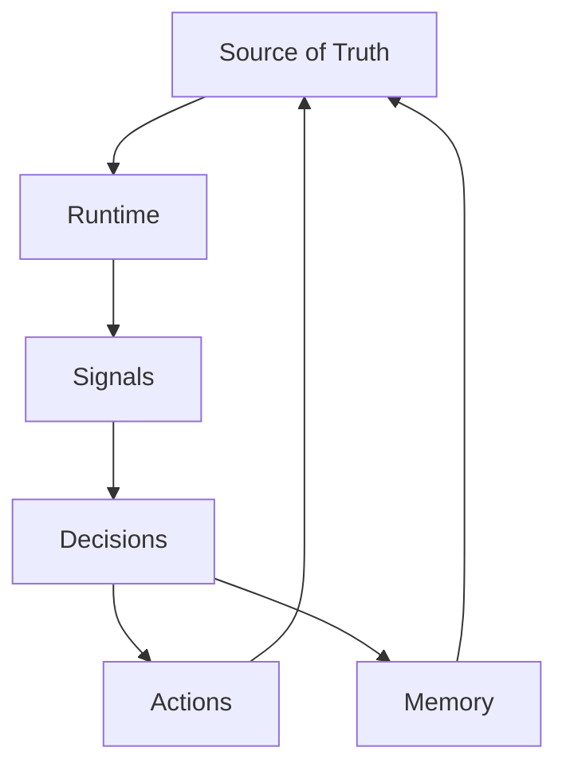

# Observability Hub Architecture

This directory contains the architectural blueprints for the Observability Hub. The system is framed as a closed-loop platform ownership model across source of truth, runtime, signals, decisions, actions, and memory.

## Architecture At A Glance

The Observability Hub is a self-hosted platform that provisions infrastructure, deploys workloads, collects telemetry, supports diagnosis, applies bounded remediation, and records operational memory. It uses observability data to reason about reliability, capacity, and cost-aware infrastructure decisions as part of the same operating loop.

For a fast mental model, the main system story is:

```mermaid
flowchart TB
    Source["Source of Truth"]
    Runtime["Runtime"]
    Signals["Signals"]
    Decisions["Decisions"]
    Actions["Actions"]
    Memory["Memory"]

    Source --> Runtime
    Runtime --> Signals
    Signals --> Decisions
    Decisions --> Actions
    Actions --> Source
    Decisions --> Memory
    Memory --> Source
```

The surrounding platform supports that flow:

- **OpenTofu + Kustomize + systemd**: Source of truth for infrastructure and services
- **Proxy**: Host-level API gateway and GitOps webhook listener
- **Worker**: Cluster-native batch engine for analytics and ingestion jobs
- **OpenTelemetry Collector**: Central intake and routing point for logs, metrics, and traces
- **LGTM Stack**: Loki, Tempo, and Prometheus as the main observability backends
- **Grafana**: Unified visualization layer for operators
- **Resource Analytics**: Kubernetes, host, and workload signals for capacity and efficiency analysis
- **Workload Security**: Trivy-scanned Dockerfiles and Kubernetes manifests with non-root, read-only-root filesystem hardening
- **MCP Gateway**: Agent-readable diagnostic and operational interface
- **ArgoCD + OpenTofu**: Deployment and reconciliation control plane

## Suggested Reading Path

Read the pages below in order:

- [Ownership Model](./ownership.md) for the end-to-end operating model
- [Observability](./core-concepts/observability.md) for the telemetry flow
- [Deployment Model](./infrastructure/deployment.md) for how the platform runs locally
- [Proxy Service](./services/proxy.md) and [Unified Worker](./services/worker.md) for the main custom services
- Automation, security, MCP, and simulation components as optional deep dives

---

## 📂 Documentation Domains

### 🧠 [Core Concepts](./core-concepts/)

Fundamental patterns and cross-cutting concerns that define how the system operates.

- **[Automation & GitOps](./core-concepts/automation.md)**: Declarative reconciliation via ArgoCD and event-driven self-healing patterns.
- **[Observability](./core-concepts/observability.md)**: Standards for JSON logging and OpenTelemetry pipelines.

### 🏗️ [Infrastructure](./infrastructure/)

The runtime environment and foundational deployment strategies.

- **[Deployment Model](./infrastructure/deployment.md)**: Details on the hybrid Kubernetes/Systemd orchestration.
- **[Security](./infrastructure/security.md)**: Tailscale Funnel gating, HMAC authentication, workload hardening, and isolation boundaries.

### ⚙️ [Services](./services/)

Deep dives into the logic and implementation of specific system components.

- **[Hardware Simulation](./services/hardware-sim.md)**: Fleet of synthetic sensors and chaos injection engine.
- **[MCP Servers](./services/mcp-servers.md)**: The "Agentic Interface" suite for autonomous operations.
- **[Proxy Service](./services/proxy.md)**: The API Gateway and GitOps listener.
- **[Tailscale Gate](./services/tailscale-gate.md)**: Logic for the automated funnel gatekeeper.
- **[Unified Worker](./services/worker.md)**: The one-shot execution engine for Analytics and Ingestion tasks.
