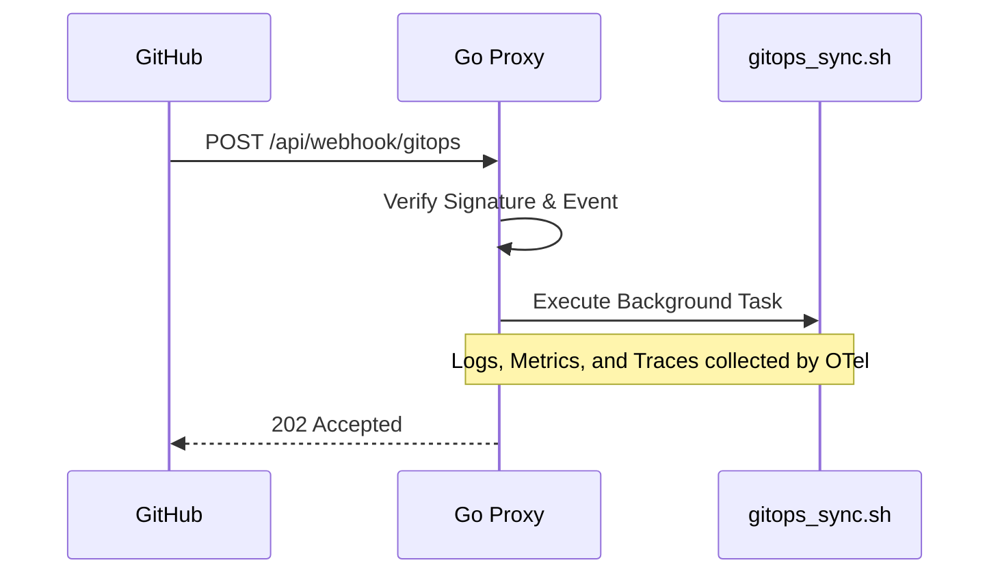

# Systemd Service Architecture

The Observability Hub leverages **Systemd** not just for process management, but as a core automation and reconciliation engine. By running lightweight agents and timers directly on the host, we ensure reliability independent of the **Kubernetes (k3s)** cluster runtime.

## Core Philosophy

- **Resilience through Decoupling**: Critical infrastructure (like GitOps and Security Gates) runs as native Systemd services to avoid "circular dependencies." This ensures the system can self-heal even if the Kubernetes runtime is unresponsive.
- **Event-Driven Automation**: We prioritize webhooks over polling. By using the Proxy as an entry point, we trigger reconciliation only when changes actually occur, reducing CPU/Network overhead.
- **Unified Observability Standard**: All services follow an OpenTelemetry-first approach. By emitting structured logs, metrics, and traces directly, we ensure a unified high-fidelity pipeline handled by the OTel Collector.

## Service Inventory

The system consists of several main service families, each with a `.service` unit (the logic) and a `.timer` unit (the schedule).

| Service Name | Type | Schedule / Trigger | Responsibility |
| :--- | :--- | :--- | :--- |
| **`tailscale-gate`** | `simple` | Continuous | **Security**: Monitors Proxy health and toggles Tailscale Funnel access. |
| **`proxy`** | `simple` | Continuous | **API Gateway**: Core listener for data pipelines and GitOps webhooks. |
| **`gitops-sync`** | `oneshot` | **Webhook** | **Reconciliation**: Triggered by Proxy to pull latest code and apply changes. |
| **`reading-sync`** | `oneshot` | Twice Daily (00:00, 12:00) | **Data Pipeline Trigger**: Calls Proxy API to sync MongoDB data to Postgres. |

## Operational Excellence

Our systemd configurations employ several production-grade patterns:

- **Security Gating**: The `tailscale-gate` service implements a loop that ensures the public entry point (Funnel) is automatically closed if the underlying `proxy` service stops, preventing "dead" endpoints from being exposed.
- **Persistence (`Persistent=true`)**: Used in `reading-sync`. If the host is powered off during the scheduled time, systemd will trigger the service immediately upon the next boot.
- **Unified Observability**: All units emit logs, metrics, and traces, which are captured, enriched, and forwarded by the host-level OpenTelemetry Collector.

## Architectural Patterns

### 1. The "Webhook-Trigger" Pattern

For GitOps, we transitioned from polling (timers) to event-driven triggers. This reduces resource consumption and ensures faster deployment cycles.

### 2. Observability Integration

For a detailed explanation of the unified logging, metrics, and tracing data flow, please refer to the [Data Flow: Unified Observability diagram in the Deployment Model documentation](../infrastructure/deployment.md#data-flow-unified-observability).

Briefly, all systemd units are configured to emit telemetry (logs, metrics, traces) via OTLP. These are collected and forwarded by a host-level OpenTelemetry Collector instance to the observability backend.

## Configuration Structure

All unit files are stored in the `systemd/` directory of the repository and are deployed/updated by the `gitops-sync` script itself.

- **`[Unit]`**: Defines dependencies (e.g., `After=network.target`).
- **`[Service]`**: Defines the `ExecStart` command and `User=server`.
- **`[Install]`**: Defines the target (usually `multi-user.target`).
