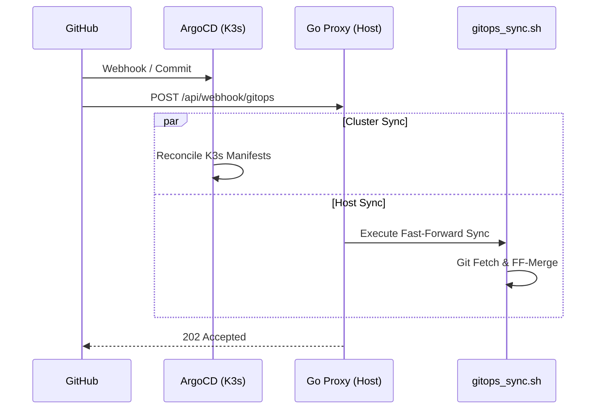

# Automation & GitOps Architecture

The Observability Hub leverages a **Dual-Tier GitOps Model** to manage both cluster infrastructure and host-level automation. By combining **ArgoCD** for Kubernetes reconciliation with **Systemd** for process management, we ensure full-stack reliability and self-healing.

## Core Philosophy

- **Declarative Kubernetes (Tier 1)**: All cluster resources are managed via **ArgoCD**. This ensures that the "Intent" defined in Git is continuously reconciled, providing automated recovery from configuration drift.
- **Resilient Host-Sync (Tier 2)**: Critical host-tier components (Proxy, Tailscale Gate) are synchronized via native Systemd services and custom scripts. This ensures the host's physical filesystem and systemd units stay in sync with the remote repository independently of the Kubernetes runtime.
- **Event-Driven Reconciliation**: We prioritize webhooks over polling. Push events from GitHub trigger a simultaneous loop: ArgoCD updates the cluster, and the Proxy-Webhook triggers a fast-forward sync of the local host directory.

## GitOps Implementation

### 1. Cluster Orchestration (ArgoCD)

The platform utilizes the **App-of-Apps pattern** to bootstrap and manage the entire stack.

- **Root Application**: Managed via OpenTofu, it monitors the `k3s/` directory and recursively deploys sub-applications (Observability, Databases, etc.).
- **Self-Healing**: Automated pruning and reconciliation ensure that manual changes via `kubectl` are automatically reverted to the Git source of truth.

### 2. Host Synchronization (Proxy & Scripts)

For native host services, the Proxy acts as the event-driven bridge.

```mermaid
sequenceDiagram
    participant GitHub
    participant Argo as ArgoCD (K3s)
    participant Proxy as Go Proxy (Host)
    participant Script as gitops_sync.sh

    GitHub->>Argo: Webhook / Commit
    GitHub->>Proxy: POST /api/webhook/gitops
    
    par Cluster Sync
        Argo->>Argo: Reconcile K3s Manifests
    and Host Sync
        Proxy->>Script: Execute Fast-Forward Sync
        Script->>Script: Git Fetch & FF-Merge
    end
    
    Proxy-->>GitHub: 202 Accepted
```

## Service Inventory (Host Tier)

The system consists of several main service families, each with a `.service` unit (the logic) and a `.timer` unit (the schedule).

| Service Name | Type | Schedule / Trigger | Responsibility |
| :--- | :--- | :--- | :--- |
| **`tailscale-gate`** | `simple` | Continuous | **Security**: Monitors Proxy health and toggles Tailscale Funnel access. |
| **`proxy`** | `simple` | Continuous | **API Gateway**: Core listener for data pipelines and GitOps webhooks. |

## Operational Excellence

Our automation employs several production-grade patterns:

- **Symmetric Configuration**: Both ArgoCD and OpenTofu inherit global resource and security policies from a centralized `_standards.yaml`.
- **Security Gating**: The `tailscale-gate` service ensures the public entry point (Funnel) is automatically closed if the underlying `proxy` service stops.
- **Unified Observability**: All automation events (ArgoCD syncs, script executions) emit telemetry to the central OTel Collector for high-fidelity correlation.
