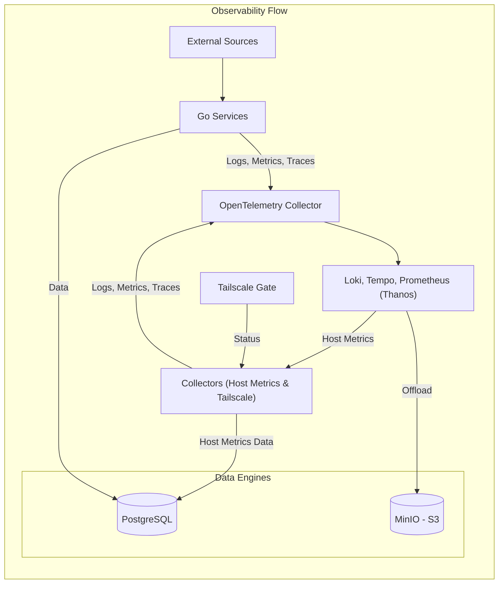

# Observability Architecture

The Observability Hub implements a high-fidelity logging, tracing, and metrics pipeline. The architecture is designed for deep visibility into native host services (via unified telemetry) and cluster infrastructure (via comprehensive metrics).

## 🛠️ The Unified Pipeline

## 🪵 Logs

The platform implements a dual-path logging strategy: structured application logs via OpenTelemetry and structured system-level logs via OpenTelemetry.

- **Logging Standards**: To ensure logs are searchable and actionable, all system components must adhere to the **JSON Logging Standard**:

| Field | Description | Example |
| :--- | :--- | :--- |
| `time` | RFC3339 Timestamp | `2026-01-21T22:00:00Z` |
| `level` | Severity (INFO, WARN, ERROR) | `ERROR` |
| `service` | Logic domain name | `proxy` |
| `msg` | Human-readable description | `GitOps sync failed` |
| `repo` | (Optional) Target repository | `mehub` |

- **Collection Pipeline**:
  - **Application Logs**: Services are instrumented with the **OpenTelemetry SDK** to generate logs in OTLP format, sent to the central **OpenTelemetry Collector** via gRPC (NodePort `30317`) or HTTP (NodePort `30318`), which batches and exports them to **Loki**.
  - **System Logs**: Native host services (e.g., `gitops-sync`, `system-metrics`, `tailscale-gate`) are instrumented to emit structured logs directly to the **OpenTelemetry Collector** (running as a DaemonSet) via OTLP, which filters for specific units and pushes them to **Loki**.
- **Persistence**:
  - **Loki**: Stores logs with long-term persistence in MinIO S3 buckets (`loki-chunks`, `loki-ruler`, `loki-admin`).

## 📊 Metrics

The platform aggregates infrastructure metrics through Prometheus scraping, application-level metrics via OpenTelemetry, and specialized analytical data.

- **Collection Strategy**:
  - **Infrastructure Scrapes**: **Prometheus** actively pulls metrics from the Kubernetes API, nodes (cAdvisor), pods, service endpoints, and internal exporters (`kube-state-metrics`, `node-exporter`).
  - **Telemetry Ingestion**: The **OpenTelemetry Collector** exports OTLP metrics (including derived span-metrics from Tempo) to **Prometheus**, which is configured with the `remote-write-receiver` enabled to ingest these metrics.
  - **Host Resource Metrics**: Host-level metrics (e.g., CPU, RAM, disk, network) are first collected by **Prometheus**. Dedicated **Collectors** then retrieve this host metrics data from **Prometheus**, forward it via the **OpenTelemetry Collector**, which processes and exports it to **PostgreSQL** for long-term analytical reporting.
- **Persistence**:
  - **Local Storage**: Prometheus maintains a high-resolution 24-hour local TSDB on `local-path` persistent volumes.
  - **Long-term Retention**: The **Thanos** sidecar seamlessly offloads TSDB blocks to MinIO S3 (`prometheus-blocks`) for infinite metrics retention and historical analysis.

## 🔭 Traces

Distributed tracing is powered by OpenTelemetry for correlation and performance profiling across high-throughput pipelines.

- **Collection Pipeline**:
  - **Instrumentation**: Services use the **OpenTelemetry SDK** to generate spans in OTLP format. We follow a **Pure Wrapper** philosophy where shared libraries (`pkg/db`) provide standardized infrastructure spans (e.g., `db.postgres.record_metric`), while services own the root spans (`job.*` or `handler.*`).
  - **Ingestion**: Spans are sent to the **OpenTelemetry Collector** via gRPC (NodePort `30317`) or HTTP (NodePort `30318`), which batches and exports them to **Grafana Tempo**.
  - **Processing**: Tempo analyzes raw spans to generate derived **Service Graphs** and **Span Metrics**, which are pushed to Prometheus via `remote_write` for operational correlation.
- **Persistence**:
  - **Tempo**: Stores traces with long-term persistence in MinIO S3 buckets (`tempo-traces`).

## 🗄️ Shared Data Stores

- **PostgreSQL**: Stores analytical metrics and specialized time-series data using local persistent volumes.
- **MinIO S3**: Provides unified object storage for Loki logs, Tempo traces, and Prometheus/Thanos metrics blocks.

Access is secured via internal Kubernetes networking (`minio.observability.svc.cluster.local:9000`) and managed via specialized secrets (`minio-thanos-secret`, etc.).
