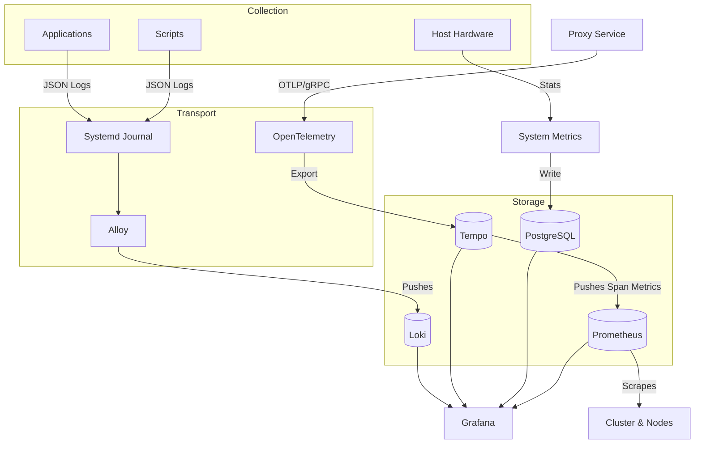

# Observability Architecture

The Observability Hub implements a high-fidelity logging, tracing, and metrics pipeline. The architecture is designed for deep visibility into native host services (via unified logging) and cluster infrastructure (via comprehensive metrics).

## 🛠️ The Unified Pipeline

## 📝 Logging Standards

To ensure logs are searchable and actionable, all system components must adhere to the **JSON Logging Standard**:

| Field | Description | Example |
| :--- | :--- | :--- |
| `time` | RFC3339 Timestamp | `2026-01-21T22:00:00Z` |
| `level` | Severity (INFO, WARN, ERROR) | `ERROR` |
| `service` | Logic domain name | `proxy` |
| `msg` | Human-readable description | `GitOps sync failed` |
| `repo` | (Optional) Target repository | `mehub` |

### Native Script Logging

Bash scripts use `jq` to generate safe JSON payloads and `logger -t <tag>` to broadcast to the system journal.

## 🗄️ Journald Integration

Native services (Proxy, Metrics) write strictly to `stdout`.

- **Metadata**: `journald` enriches these streams with metadata like `_SYSTEMD_UNIT` and `SYSLOG_IDENTIFIER`.
- **Collection**: **Alloy** is configured as a Kubernetes DaemonSet to scrape `/var/log/journal` directly and push to **Loki**.

## 🕵️ Distributed Tracing

The platform uses **OpenTelemetry (OTEL)** for request correlation and performance profiling, specifically targeting high-throughput data pipelines.

- **Standard**: Services are instrumented with the OTEL SDK to generate spans in OTLP format. Currently, this is focused on the **Proxy Service** to trace analytical data ingestion.
- **Scope**: Other system components like `system-metrics` are currently out-of-scope for tracing as they are simple, non-interactive collectors.
- **Pipeline**: Spans are sent to a central **OpenTelemetry** (NodePort `30317`), which batches and exports them to **Grafana Tempo**.

## 📊 Metrics & Telemetry

System and application metrics are collected through a multi-path strategy:

1. **Analytical Metrics**: Hardware-level telemetry (CPU, Disk, Memory) is collected by `system-metrics` and persisted in **PostgreSQL** for long-term analytical queries.
2. **Infrastructure Metrics**: Cluster health, node performance, and container metrics are scraped directly by **Prometheus**.
3. **Service Graphs**: **Grafana Tempo** generates metrics from spans (span-metrics) and pushes them to **Prometheus** via `remote_write`, enabling the visualization of service-to-service dependency graphs.

## 📈 Prometheus Role

Prometheus acts as the central time-series storage for the cluster:

- **Scraping**: Pulls metrics from Kubernetes service endpoints, cAdvisor, and node-exporters.
- **Ingestion**: Receives span-metrics forwarded by Tempo.
- **Storage**: Configured with local persistence within the k3s cluster (Alertmanager is disabled to minimize resource footprint).

## 🏷️ Label Normalization

Alloy applies sophisticated relabeling to create a unified search experience in Grafana:

1. **Unit to Service**: `proxy.service` becomes the label `service="proxy"`.
2. **Tag to Service**: `logger -t gitops-sync` results in the label `service="gitops-sync"`.
3. **Noise Reduction**: Logs from the logging infrastructure itself (`loki`, `alloy`) are dropped at the scrape stage to prevent feedback loops.
