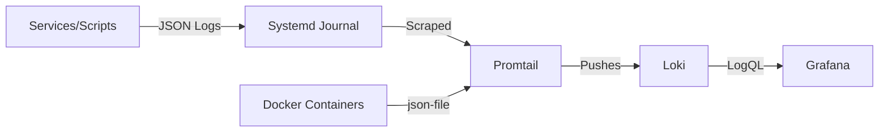

# Observability Architecture

The Observability Hub implements a high-fidelity logging and telemetry pipeline designed for deep visibility into both containerized and native services.

## 🛠️ The Pipeline

## 📝 Logging Standards

To ensure logs are searchable and actionable, all system components must adhere to the **JSON Logging Standard**:

| Field | Description | Example |
| :--- | :--- | :--- |
| `time` | RFC3339 Timestamp | `2026-01-21T22:00:00Z` |
| `level` | Severity (INFO, WARN, ERROR) | `ERROR` |
| `service` | Logic domain name | `proxy` |
| `msg` | Human-readable description | `GitOps sync failed` |
| `repo` | (Optional) Target repository | `mehub` |

### Native Script Logging

Bash scripts use `jq` to generate safe JSON payloads and `logger -t <tag>` to broadcast to the system journal.

## 🗄️ Journald Integration

Native services (Proxy, Metrics) write strictly to `stdout`.

- **Metadata**: `journald` enriches these streams with metadata like `_SYSTEMD_UNIT` and `SYSLOG_IDENTIFIER`.
- **Collection**: Promtail is configured to scrape `/var/log/journal` directly.

## 🏷️ Label Normalization

Promtail applies sophisticated relabeling to create a unified search experience in Grafana:

1. **Unit to Service**: `proxy.service` becomes the label `service="proxy"`.
2. **Tag to Service**: `logger -t gitops-sync` results in the label `service="gitops-sync"`.
3. **Noise Reduction**: Logs from the logging infrastructure itself (`loki`, `promtail`) are dropped at the scrape stage to prevent feedback loops.
