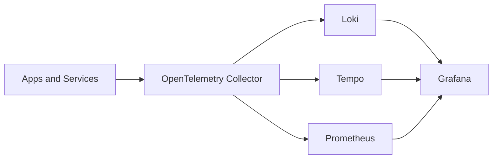
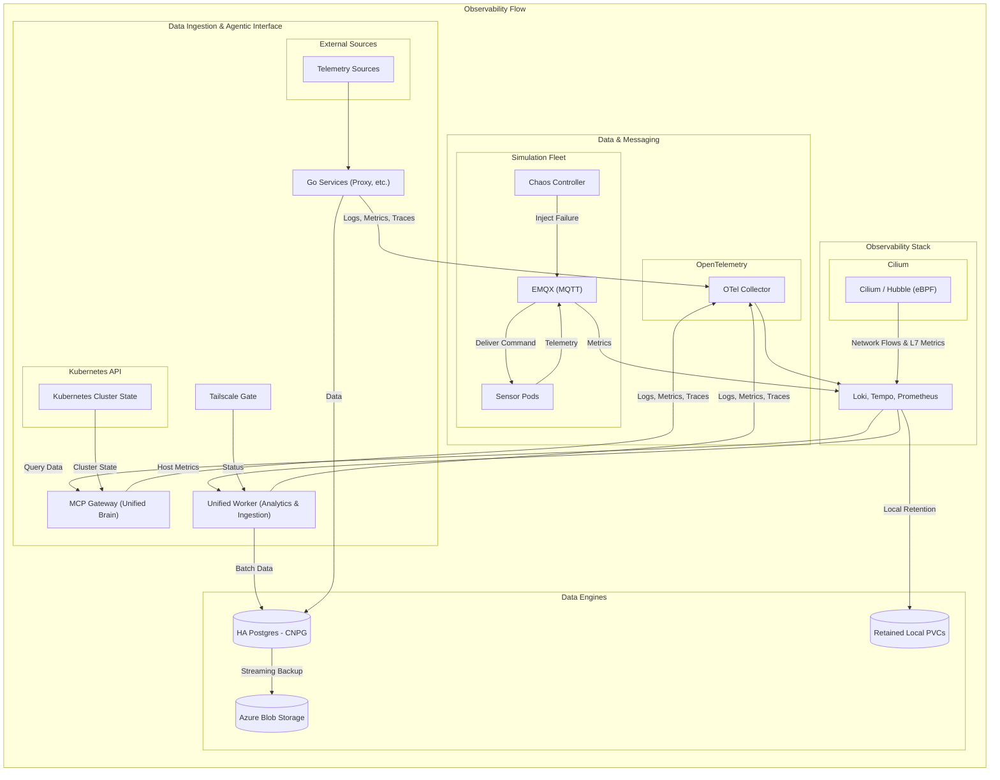

# Observability Architecture

The Observability Hub implements a high-fidelity logging, tracing, and metrics pipeline. The architecture is designed for deep visibility into native host services (via unified telemetry) and cluster infrastructure (via comprehensive metrics).

## Simplified Overview

At the highest level, this platform answers a simple question:

How does telemetry move from running services to operator dashboards?

The short answer is:

`Apps and services -> OpenTelemetry Collector -> Loki / Tempo / Prometheus -> Grafana`

This model keeps the telemetry path clear before introducing the supporting subsystems. The same telemetry also supports capacity planning and cost-aware infrastructure analysis because resource usage is tied back to the workloads and systems that produced it.

```mermaid
flowchart LR
    Apps["Apps and Services"]
    OTel["OpenTelemetry Collector"]
    Logs["Loki"]
    Traces["Tempo"]
    Metrics["Prometheus"]
    Grafana["Grafana"]

    Apps --> OTel
    OTel --> Logs
    OTel --> Traces
    OTel --> Metrics
    Logs --> Grafana
    Traces --> Grafana
    Metrics --> Grafana
```

The sections below expand this simplified story into the full implementation, including MCP access, eBPF network visibility, storage backends, and local retention.

## 🛠️ The Unified Pipeline

```mermaid
flowchart TB
    subgraph ObservabilityFlow ["Observability Flow"]
        direction TB
        subgraph Logic ["Data Ingestion & Agentic Interface"]
            subgraph ExternalSources ["External Sources"]
                External["Telemetry Sources"]
            end

            subgraph Kube["Kubernetes API"]
              K3S["Kubernetes Cluster State"]
            end

            GoApps["Go Services (Proxy, etc.)"]
            MCP["MCP Gateway (Unified Brain)"]
            Worker["Unified Worker (Analytics & Ingestion)"]
            Gate[Tailscale Gate]
        end

        subgraph DataPlatform ["Data & Messaging"]
            subgraph Simulation ["Simulation Fleet"]
                Chaos["Chaos Controller"]
                Sensors["Sensor Pods"]
                EMQX["EMQX (MQTT)"]
            end
            subgraph OtelCollector ["OpenTelemetry"]
                OTEL[OTel Collector]
            end
        end

        subgraph Observability ["Observability Stack"]
        subgraph Kernal ["Cilium"]
          Cilium["Cilium / Hubble (eBPF)"]
        end

          LGTM["Loki, Tempo, Prometheus"]
        end

        subgraph Storage ["Data Engines"]
            PG[(HA Postgres - CNPG)]
            PVC[(Retained Local PVCs)]
            Azure[(Azure Blob Storage)]
        end
    end

    %% Data Pipeline Connections
    External --> GoApps
    
    %% Unified MCP Paths
    LGTM -- "Query Data" --> MCP
    K3S -- "Cluster State" --> MCP

    %% Simulation Flow
    Chaos -- "Inject Failure" --> EMQX
    EMQX -- "Deliver Command" --> Sensors
    Sensors -- "Telemetry" --> EMQX
    EMQX -- "Metrics" --> LGTM

    %% Telemetry & Storage Connections
    LGTM -- "Host Metrics" --> Worker
    Gate -- "Status" --> Worker
    Worker -- "Batch Data" --> PG
    GoApps -- Data --> PG

    %% Telemetry Pipeline (OTLP)
    GoApps & MCP & Worker -- "Logs, Metrics, Traces" --> OTEL
    Cilium -- "Network Flows & L7 Metrics" --> LGTM
    
    OTEL --> LGTM
    
    %% Resilience & Backup
    LGTM -- "Local Retention" --> PVC
    PG -- "Streaming Backup" --> Azure
```

## 🪵 Logs

The platform implements a dual-path logging strategy: structured application logs via OpenTelemetry and structured system-level logs via OpenTelemetry.

- **Logging Standards**: To ensure logs are searchable and actionable, all system components must adhere to the **JSON Logging Standard**:

| Field | Description | Example |
| :--- | :--- | :--- |
| `time` | RFC3339 Timestamp | `2026-01-21T22:00:00Z` |
| `level` | Severity (INFO, WARN, ERROR) | `ERROR` |
| `service` | Logic domain name | `proxy` |
| `msg` | Human-readable description | `GitOps sync failed` |
| `repo` | (Optional) Target repository | `mehub` |

- **PII Masking & Redaction**: To prevent the accidental leakage of sensitive information, the platform implements automated PII masking at the telemetry package level.
  - **Mechanism**: A custom `slog.Handler` (the `PIIHandler`) intercepts all log records and redacts values for a predefined list of sensitive keys using a `ReplaceAttr` strategy.
  - **Redacted Keys**: Includes `password`, `secret`, `token`, `api_key`, `email`, `phone`, `authorization`, `cookie`, etc.
  - **Output**: Sensitive values are replaced with the literal string `[REDACTED]` before being exported to either stdout or Loki.

- **Collection Pipeline**:
  - **Application Logs**: Services are instrumented with the **OpenTelemetry SDK** to generate logs in OTLP format, sent to the central **OpenTelemetry Collector** via gRPC (NodePort `30317`) or HTTP (NodePort `30318`), which batches and exports them to **Loki**.
  - **System Logs**: Native host services (e.g., `gitops-sync`, `system-metrics`, `tailscale-gate`) are instrumented to emit structured logs directly to the **OpenTelemetry Collector** (running as a DaemonSet) via OTLP, which filters for specific units and pushes them to **Loki**.
- **Persistence**:
  - **Loki**: Stores logs on retained local PVC storage with `168h` retention.

## 📊 Metrics

The platform aggregates infrastructure metrics through Prometheus scraping, application-level metrics via OpenTelemetry, and specialized analytical data. These metrics are used for reliability diagnosis first, then extended into capacity and efficiency analysis so cost becomes one operational signal among CPU, memory, storage, network, and workload behavior.

- **Collection Strategy**:
  - **Infrastructure Scrapes**: **Prometheus** actively pulls metrics from the Kubernetes API, nodes (cAdvisor), pods, service endpoints, and internal exporters (`kube-state-metrics`, `node-exporter`).
  - **Telemetry Ingestion**: The **OpenTelemetry Collector** exports OTLP metrics (including derived span-metrics from Tempo) to **Prometheus**, which is configured with the `remote-write-receiver` enabled to ingest these metrics.
  - **Host Resource Metrics**: Host-level metrics (e.g., CPU, RAM, disk, network) are first collected by **Prometheus**. The **Unified Worker (Analytics Mode)** then retrieves this data directly from **Prometheus**, forwards it via the **OpenTelemetry Collector**, and exports it to **PostgreSQL** for long-term resource, capacity, and cost-aware analytical reporting.
  - **Network Metrics (eBPF)**: Cilium and Hubble export eBPF-level network metrics (e.g., packet drops, connection latency, and L7 protocol stats) directly to Prometheus via dedicated exporters.
- **Persistence**:
  - **Local Storage**: Prometheus maintains a high-resolution `72h` local TSDB on `local-path-retain` persistent volumes.

## 🔭 Traces

Distributed tracing is powered by OpenTelemetry for correlation and performance profiling across high-throughput pipelines.

- **Collection Pipeline**:
  - **Instrumentation**: Services use the **OpenTelemetry SDK** to generate spans in OTLP format. The platform follows a **Pure Wrapper** pattern where shared libraries (`internal/db`) provide standardized infrastructure spans (e.g., `db.postgres.record_metric`), while services own the root spans (`job.*` or `handler.*`).
  - **Ingestion**: Spans are sent to the **OpenTelemetry Collector** via gRPC (NodePort `30317`) or HTTP (NodePort `30318`), which batches and exports them to **Grafana Tempo**.
  - **Processing**: Tempo analyzes raw spans to generate derived **Service Graphs** and **Span Metrics**, which are pushed to Prometheus via `remote_write` for operational correlation.
- **Persistence**:
  - **Tempo**: Stores traces on retained local PVC storage with `48h` retention.

## 📡 Network Observability (eBPF)

The platform leverages **Cilium** and **Hubble** for deep, kernel-level network visibility.

- **L7 Visibility (MQTT)**: Cilium's eBPF-native datapath enables sidecar-less inspection of application-level protocols. This allows the platform to attribute network traffic to specific MQTT topics without requiring modifications to the application code.
- **Autonomous Flow Analysis**: Beyond the Hubble UI, the platform exposes raw flow data directly to AI agents via the MCP `observe_network_flows` tool. This enables instantaneous, packet-level auditing of `FORWARDED`, `DROPPED`, and `DENIED` traffic across the entire cluster.
- **Service Mapping**: Hubble provides a real-time service map and detailed flow logs, enabling engineers to visualize and troubleshoot network connectivity and performance between pods and host services.
- **Metrics Correlation**: Network-level signals (like connection latency or throughput) are correlated with application-level traces and hardware-level energy metrics (Kepler) to provide a complete view of system efficiency and infrastructure cost drivers.

## 🗄️ Shared Data Stores

- **PostgreSQL (CloudNativePG)**: Stores analytical metrics and specialized time-series data (TimescaleDB). Orchestrated by CNPG for high availability, with automated failover and streaming backups to Azure Blob Storage.
- **Retained Local PVCs**: Store Prometheus metrics, Loki logs, and Tempo traces for short local retention windows without object storage.
- **Azure Blob Storage**: Serves as the durable off-site backup for PostgreSQL transactional data (WALs/Basebackups) and the global repository for OpenTofu state.

Access is secured via internal Kubernetes networking and managed through specialized secrets such as `azure-creds` for PostgreSQL backup.
