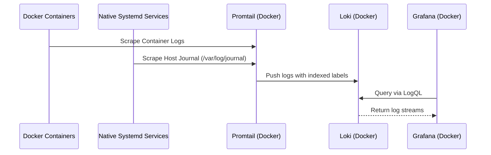

# Infrastructure & Deployment

The infrastructure layer follows a **hybrid model**: core data services (Storage, Logs, Viz) are orchestrated via Docker Compose, while application logic and automation agents run as native host-level Systemd services for direct hardware and filesystem access.

## Component Details

| Component | Role | Details |
| :--- | :--- | :--- |
| **PostgreSQL (TimescaleDB)** | Primary Storage | Dockerized central store for metrics and analytical data. |
| **Loki** | Log Aggregation | Dockerized indexer for metadata-tagged logs. |
| **Grafana** | Visualization | Dockerized UI connecting to Postgres and Loki. |
| **Promtail** | Log Agent | Dockerized agent that scrapes both Docker container logs and the **Host Systemd Journal**. |
| **Proxy Service** | API & GitOps Trigger | Native Go binary running as a Systemd service. Handles webhooks and data pipelines. |
| **Tailscale Gate** | Security Agent | Native script ensuring the Public Funnel is only open when the Proxy is healthy. |

## Data Flow: Unified Logging

## Deployment Strategy

- **Orchestration**: `docker-compose.yml` for data infrastructure (Postgres, Grafana, Loki, Promtail).
- **Native Services**: Systemd units for the **Proxy**, **Tailscale Gate**, and **Metrics Collector**.
- **Automation**: `Makefile` for lifecycle management (build, restart, install).
- **Persistence**: External Docker volumes (`postgres_data`, etc.) for container data.
- **Event-Driven Sync**: GitHub Webhooks trigger the local `gitops_sync.sh` via the Proxy service.

## Configuration & Security

### Network Security

- **Isolation**: Dockerized services communicate on an internal network.
- **Funnel Integration**: The **Tailscale Gate** manages `tailscale funnel` to expose only port `8085` (Proxy) to the public internet securely via port `8443`.
- **Exposed Ports**:
  - `3001`: Grafana (Internal/VPN access)
  - `3100`: Loki (Internal)
  - `5432`: PostgreSQL (Internal)
  - `8085`: Proxy Service (Publicly available via Tailscale Funnel)
