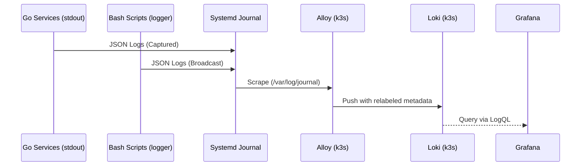

# Infrastructure & Deployment

The infrastructure layer follows a **hybrid model**: core data services (Storage, Logs, Viz) are orchestrated via **Kubernetes (k3s)**, while application logic and automation agents run as native host-level Systemd services for direct hardware and filesystem access.

## Component Details

### ☸️ Data Infrastructure (Kubernetes)

| Component | Role | Details |
| :--- | :--- | :--- |
| **Alloy** | Telemetry Agent | DaemonSet that scrapes the **Host Systemd Journal**. |
| **Grafana** | Visualization | Deployment for unified dashboarding UI. |
| **Loki** | Log Aggregation | StatefulSet for indexing metadata-tagged logs. |
| **MinIO** | Object Storage | Deployment for S3-compatible storage (Tempo traces and backups). |
| **OpenTelemetry** | Telemetry Hub | Deployment for receiving and processing traces and metrics. |
| **PostgreSQL** | Primary Storage | StatefulSet with TimescaleDB + PostGIS for metrics and analytical data. |
| **Prometheus** | Metrics Storage | Deployment for time-series infrastructure and service metrics. |
| **Tempo** | Trace Storage | StatefulSet for high-scale distributed tracing persistence via MinIO. |
| **Thanos** | Long-term Metrics | StatefulSet for querying historical metrics stored in MinIO. |

### 🚀 Core Services (Native Go)

| Component | Role | Details |
| :--- | :--- | :--- |
| **Proxy Service** | API Gateway | Handles webhooks, GitOps triggers, and Data Pipelines. |
| **Metrics Collector** | Telemetry Agent | Collects host hardware statistics (CPU, RAM, Disk). |
| **Second Brain** | Knowledge Ingest | Ingests atomic journal entries from GitHub Issues. |

### 🛠️ Automation & Security (Native Script)

| Component | Role | Details |
| :--- | :--- | :--- |
| **OpenBao** | Secret Store | Centralized, encrypted management for sensitive config. |
| **Tailscale Gate** | Security Agent | Manages public funnel access based on service health. |
| **Reading Sync** | Data Pipeline | Timer-triggered task to sync cloud data to local storage. |

## Data Flow: Unified Logging

## Deployment Strategy

- **Orchestration**: **Kubernetes (k3s)** for data infrastructure.
- **Native Services**: Systemd units for high-performance and host-level tasks.
- **Automation**: `Makefile` for lifecycle management (build, restart, install).
- **Persistence**: Kubernetes **PersistentVolumeClaims (PVCs)** for data durability.
- **Event-Driven Sync**: GitHub Webhooks trigger the local `gitops_sync.sh` via the Proxy.

## Configuration & Security

### Network Security

- **Isolation**: Workloads communicate on an internal Kubernetes cluster network.
- **Funnel Integration**: The **Tailscale Gate** manages `tailscale funnel` to expose only port `8085` (Proxy) to the public internet securely via port `8443`.
- **Exposed Ports**:
  - `30000`: Grafana (Kubernetes NodePort)
  - `30432`: PostgreSQL (Kubernetes NodePort)
  - `30317`: OpenTelemetry (OTLP gRPC NodePort)
  - `30318`: OpenTelemetry (OTLP HTTP NodePort)
  - `8085`: Proxy Service (Publicly available via Tailscale Funnel)
