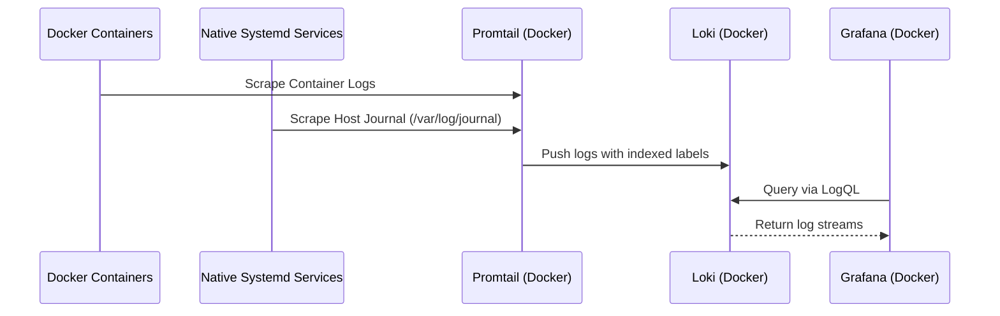

# Infrastructure & Deployment

The infrastructure layer follows a **hybrid model**: core data services (Storage, Logs, Viz) are orchestrated via Docker Compose, while application logic and automation agents run as native host-level Systemd services for direct hardware and filesystem access.

## Component Details

### 🗄️ Data Infrastructure (Docker)

| Component | Role | Details |
| :--- | :--- | :--- |
| **PostgreSQL** | Primary Storage | TimescaleDB + PostGIS for metrics and analytical data. |
| **Loki** | Log Aggregation | Indexer for metadata-tagged logs. |
| **Grafana** | Visualization | Unified dashboarding UI for Postgres and Loki. |
| **Promtail** | Log Agent | Scrapes Docker container logs and the **Host Systemd Journal**. |

### 🚀 Core Services (Native Go)

| Component | Role | Details |
| :--- | :--- | :--- |
| **Proxy Service** | API Gateway | Handles webhooks, GitOps triggers, and Data Pipelines. |
| **Metrics Collector** | Telemetry Agent | Collects host hardware statistics (CPU, RAM, Disk). |

### 🛠️ Automation & Security (Native Script)

| Component | Role | Details |
| :--- | :--- | :--- |
| **OpenBao** | Secret Store | Centralized, encrypted management for sensitive config. |
| **Tailscale Gate** | Security Agent | Manages public funnel access based on service health. |
| **Reading Sync** | Data Pipeline | Timer-triggered task to sync cloud data to local storage. |
| **Volume Backup** | Backup Agent | Automated backup utility for Docker volumes. |

## Data Flow: Unified Logging

## Deployment Strategy

- **Orchestration**: `docker-compose.yml` for data infrastructure.
- **Native Services**: Systemd units for high-performance and host-level tasks.
- **Automation**: `Makefile` for lifecycle management (build, restart, install).
- **Persistence**: External Docker volumes for container data sustainability.
- **Event-Driven Sync**: GitHub Webhooks trigger the local `gitops_sync.sh` via the Proxy.

## Configuration & Security

### Network Security

- **Isolation**: Dockerized services communicate on an internal network.
- **Funnel Integration**: The **Tailscale Gate** manages `tailscale funnel` to expose only port `8085` (Proxy) to the public internet securely via port `8443`.
- **Exposed Ports**:
  - `3001`: Grafana (Internal/VPN access)
  - `3100`: Loki (Internal)
  - `5432`: PostgreSQL (Internal)
  - `8085`: Proxy Service (Publicly available via Tailscale Funnel)
