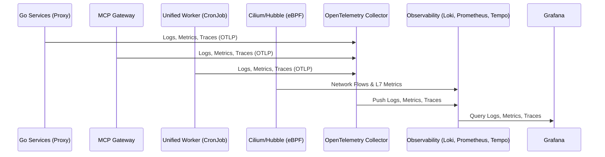

# Infrastructure & Deployment

The infrastructure layer follows a **hybrid model**: core data services (Storage, Logs, Viz) are orchestrated via **OpenTofu** on **Kubernetes (k3s)**, while application logic and automation agents run as native host-level Systemd services for direct hardware and filesystem access.

## Component Details

### ☸️ Data Infrastructure (Kubernetes)

Managed via **OpenTofu (IaC)** and **ArgoCD (GitOps)**.

| Component | Role | Details |
| :--- | :--- | :--- |
| **ArgoCD** | GitOps Orchestrator | Controller for declarative cluster state management and automated self-healing. |
| **Unified Worker** | Batch Task Engine | CronJobs for collecting host telemetry (Analytics) and synchronizing data sources (Ingestion). |
| **Cilium & Hubble** | eBPF Networking | CNI with eBPF-native datapath for L7 visibility (MQTT) and network-level observability. |
| **Grafana** | Visualization | Deployment for unified dashboarding UI. |
| **Loki** | Log Aggregation | StatefulSet for indexing metadata-tagged logs. |
| **MinIO** | Object Storage | Deployment for S3-compatible storage, serving as backup for Prometheus, Loki, and Tempo. |
| **OpenTelemetry Collector** | Telemetry Hub | Deployment for receiving and processing traces, metrics, and logs. |
| **HA PostgreSQL (CNPG)** | Primary Storage | StatefulSet orchestrated by CloudNativePG for High-Availability. Automated failover and streaming backups to Azure Blob Storage. |
| **Prometheus** | Metrics Storage | Deployment for time-series infrastructure and service metrics. |
| **Tempo** | Trace Storage | StatefulSet for high-scale distributed tracing persistence via MinIO. |
| **Thanos** | Long-term Metrics | StatefulSet for querying historical metrics stored in MinIO. |

### 🚀 Core Services (Native Go)

| Component | Role | Details |
| :--- | :--- | :--- |
| **Proxy Service** | API Gateway | Handles webhooks, GitOps triggers, and Data Pipelines. |

### 🛠️ Automation & Security (Native Script)

| Component | Role | Details |
| :--- | :--- | :--- |
| **OpenBao** | Secret Store | Centralized, encrypted management for sensitive config. |
| **Tailscale Gate** | Security Agent | Manages public funnel access based on service health. |

## Data Flow: Unified Observability

```mermaid
sequenceDiagram
    participant App as Go Services (Proxy)
    participant MCP as MCP Gateway
    participant Worker as Unified Worker (CronJob)
    participant Cilium as Cilium/Hubble (eBPF)
    participant OTel_Collector as OpenTelemetry Collector
    participant Observability as Observability (Loki, Prometheus, Tempo)
    participant Grafana as Grafana

    App->>OTel_Collector: Logs, Metrics, Traces (OTLP)
    MCP->>OTel_Collector: Logs, Metrics, Traces (OTLP)
    Worker->>OTel_Collector: Logs, Metrics, Traces (OTLP)
    Cilium->>Observability: Network Flows & L7 Metrics

    OTel_Collector->>Observability: Push Logs, Metrics, Traces
    Observability->>Grafana: Query Logs, Metrics, Traces
```

## Deployment Strategy

- **Orchestration (Bootstrap)**: **OpenTofu** manages foundational CNI, namespaces, and the ArgoCD control plane.
- **Orchestration (Workloads)**: **ArgoCD** manages all Kubernetes manifests within the `k3s/` directory tree using an "App-of-Apps" pattern.
- **Native Services**: Systemd units for high-performance and host-level tasks.
- **Automation**: `Makefile` for local lifecycle management; GitHub Webhooks trigger both ArgoCD reconciliation and local host synchronization (`gitops_sync.sh`).
- **Persistence**: Kubernetes **PersistentVolumeClaims (PVCs)** using the `local-path-retain` StorageClass for data durability.

## Configuration & Security

### Network Security

- **Isolation**: Workloads communicate on an internal Kubernetes cluster network.
- **Funnel Integration**: The **Tailscale Gate** manages `tailscale funnel` to expose only port `8085` (Proxy) to the public internet securely via port `8443`.
- **Exposed Ports**:
  - `30088`: ArgoCD (Kubernetes NodePort)
  - `30000`: Grafana (Kubernetes NodePort)
  - `30432`: PostgreSQL (Kubernetes NodePort)
  - `30317`: OpenTelemetry (OTLP gRPC NodePort)
  - `30318`: OpenTelemetry (OTLP HTTP NodePort)
  - `30067`: Hubble UI (Kubernetes NodePort)
  - `8085`: Proxy Service (Publicly available via Tailscale Funnel)
