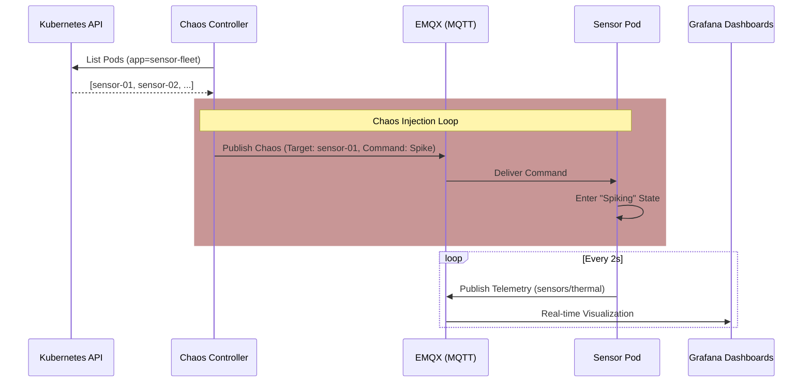

# Hardware Simulation & Chaos Engineering Architecture

The Hardware Simulation domain (`cmd/sensor`, `cmd/chaos-controller`) provides a high-fidelity emulation layer for IoT and hardware-centric observability. It simulates a fleet of sensors (e.g., ESP32 or Drone Flight Controllers) to test platform resilience, telemetry correlation, and chaos engineering practices.

## 🎯 Objective

To build operational intuition for hardware failure modes and real-time telemetry. By simulating "physical" signals like temperature spikes, power sags, and network jitter, the platform enables the testing of SRE principles (Alerting, Incident Response, Chaos) in a controlled, cloud-native environment.

## 🧩 Component Details

### 📡 Sensor Fleet (`sensor`)

- **Type**: Kubernetes Deployment (`hardware-sim` namespace).
- **Role**: Simulates an individual hardware device emitting real-time telemetry.
- **Logic**:
  - **Boot Sequence**: Emits serial-style logs to Loki mimicking a hardware bootloader.
  - **Telemetry**: Generates synthetic `temperature` and `power_usage` data.
  - **Hardware Integration**: If available, reads the physical host temperature via `hostPath` mount (`/sys/class/thermal`).
  - **Communication**: Publishes JSON payloads to the `sensors/thermal` topic on the EMQX broker.
- **Resilience**: Subscribes to its own chaos topic (`sensors/<pod-name>/chaos`) to receive failure instructions.

### 🌪️ Chaos Controller (`chaos-controller`)

- **Type**: Kubernetes Deployment.
- **Role**: The "Adversary" that injects periodic failure modes into the sensor fleet.
- **Logic**:
  - **Discovery**: Queries the Kubernetes API to identify active `sensor-fleet` pods.
  - **Injection**: Randomly selects a target pod and publishes a `ChaosCommand` (e.g., "spike") via MQTT.
  - **Parameters**: Randomizes the duration (10s-30s) and intensity (low, medium, high) of the failure.

## ⚙️ Data Flow & Orchestration

## 🔭 Observability Implementation

The simulation is fully integrated into the platform's observability stack:

- **Logs**: Boot sequences and chaos event transitions are emitted as structured logs and collected by Grafana Loki.
- **Metrics**: EMQX stats are scraped by Prometheus, providing visibility into the message throughput and client connectivity of the simulation fleet.
- **Visualization**: Specialized Grafana dashboards track the correlation between chaos injections (spikes) and system resource consumption (Kepler energy metrics).
- **Agentic Audit**: AI agents (via MCP) can use the `delete_pod` tool to simulate further infrastructure chaos or use `query_logs` to diagnose emulated hardware crashes (e.g., "Brownout" or "OOM").

## 🛡️ Future Roadmap

As outlined in `plan-hardware-sim.md`, the simulation will evolve to include:

- **Voltage Sag**: Emulating battery drops during high-throughput MQTT bursts.
- **Signal Multi-path**: Simulating radio interference through RSSI and SNR fluctuations.
- **Link Quality**: Correlating network latency with simulated "Physical Obstacles."
