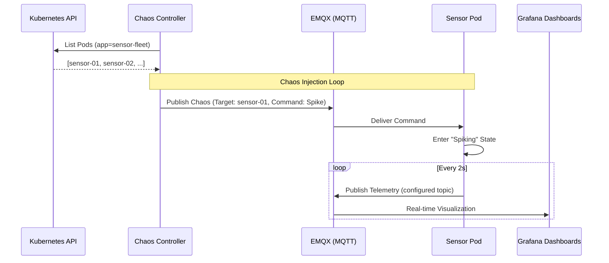

# Hardware Simulation Learning Lab

The Hardware Simulation domain (`cmd/sensor`, `cmd/chaos-controller`) is an exploratory learning lab for hardware-style telemetry. It is not a production robotics stack or a serious hardware-control system. It simulates a small fleet of sensor-like workloads so the project can explore how data from sensors, drones, robots, or other edge devices might be collected, transported, monitored, and diagnosed.

## Objective

To build practical intuition for hardware monitoring. By simulating physical-ish signals like temperature, power usage, power sag, weak radio links, and delayed messages, the project can practice the monitoring loop without needing real hardware on day one.

## Component Details

### Sensor Fleet (`sensor`)

- **Type**: Kubernetes StatefulSet (`hardware-sim` namespace).
- **Role**: Simulates an individual hardware device emitting real-time telemetry.
- **Logic**:
  - **Boot Sequence**: Emits serial-style logs to Loki mimicking a hardware bootloader.
  - **Telemetry**: Generates synthetic `temperature`, `voltage`, `current`, and `power_usage` data.
  - **Identity**: Uses the stable StatefulSet pod name as `device_id`, while `sensor_id` remains the runtime sensor identity.
  - **Firmware Metadata**: Publishes `firmware_version` with every telemetry payload.
  - **Hardware Integration**: If available, reads the physical host temperature via `hostPath` mount (`/sys/class/thermal`).
  - **Communication**: Publishes JSON payloads to the configured telemetry topic, currently `sensors/thermal`, on the EMQX broker.
- **Failure Hooks**: Subscribes to its own chaos topic (`sensors/<pod-name>/chaos`) to receive simulated failure instructions.

### Current Baseline

- Publishes sensor telemetry with `sensor_id`, `device_id`, `firmware_version`, `telemetry_topic`, `temperature`, `voltage`, `current`, `power_usage`, and `timestamp`.
- Uses `sensors/thermal` as the configured thermal telemetry topic.
- Uses `sensors/<pod-name>/chaos` as the per-sensor chaos topic.
- Supports the current `spike` chaos command for temporary thermal load, current draw, power increase, and voltage sag.
- Does not yet publish explicit lifecycle state in telemetry.

### Device Lifecycle Model

The lifecycle model is the shared vocabulary for future sensor state reporting:

| State | Meaning |
| :--- | :--- |
| `booting` | Device process has started and is preparing local runtime state. |
| `connecting` | Device is trying to connect to MQTT or another telemetry transport. |
| `running` | Device is healthy enough to publish normal telemetry. |
| `degraded` | Device is still running, but readings or delivery are affected by a simulated fault. |
| `sleeping` | Device is intentionally quiet or publishing less often to model low-power behavior. |
| `rebooting` | Device is restarting because of a planned reset or simulated hardware-style fault. |
| `failed` | Device cannot continue normal operation without an external restart or intervention. |

In the current implementation, `running` is implied during normal telemetry publishing, and `degraded` is implied while a spike command is active.

### Chaos Controller (`chaos-controller`)

- **Type**: Kubernetes Deployment.
- **Role**: A small experiment driver that injects periodic failure modes into the sensor fleet.
- **Logic**:
  - **Discovery**: Queries the Kubernetes API to identify active `sensor-fleet` pods.
  - **Injection**: Randomly selects a target pod and publishes a `ChaosCommand` (e.g., "spike") via MQTT.
  - **Parameters**: Randomizes the duration (10s-30s) and intensity (low, medium, high) of the failure.

## Data Flow & Orchestration

## Observability Implementation

The simulation uses the platform's observability stack as a learning surface:

- **Logs**: Boot sequences and chaos event transitions are emitted as structured logs and collected by Grafana Loki.
- **Metrics**: EMQX stats are scraped by Prometheus, providing visibility into the message throughput and client connectivity of the simulation fleet.
- **Visualization**: Grafana dashboards track the relationship between simulated sensor behavior, pod health, network traffic, and resource consumption.
- **Agentic Audit**: AI agents (via MCP) can use pod, log, metric, and network tools to inspect what happened during an experiment.
