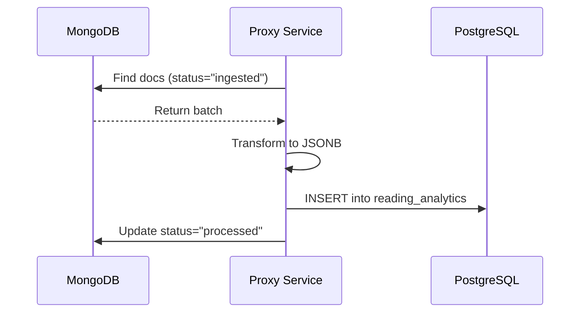

# Proxy Service Architecture

The Proxy Service (`proxy/`) is a custom Go application that acts as the API gateway, Data Pipeline engine, and **GitOps automation trigger** for the platform. It runs as a native host process managed by Systemd.

## Component Details

### API Overview

| Endpoint | Method | Purpose |
| :--- | :--- | :--- |
| `/` | GET | Returns a JSON welcome message. |
| `/api/webhook/gitops` | POST | **GitOps Trigger**: Handles GitHub webhooks (Push/PR events) to sync local repositories. |
| `/api/sync/reading` | POST | Synchronizes reading data from MongoDB to PostgreSQL (TimescaleDB). |

### Endpoint Details

#### GitOps Automation (`/api/webhook/gitops`)

This endpoint enables event-driven deployment.

1. **Verify**: Validates the `X-Hub-Signature-256` header using the `GITHUB_WEBHOOK_SECRET`.
2. **Filter**: Inspects the `X-GitHub-Event` and JSON payload to ensure the change is a **Push** to `main` or a **Merged PR** targeting `main`.
3. **Trigger**: Executes the local `scripts/gitops_sync.sh` script in the background.
4. **Log**: Broadcasts success/failure details to the system journal for observability.

#### Data Pipeline Engine (`/api/sync/reading`)

This endpoint triggers the extraction, transformation, and loading of data.

1. **Connect**: Establishes connection to MongoDB using `MONGO_URI`.
2. **Query**: Finds documents in the source collection where `status="ingested"`.
3. **Transform**: Converts documents into a standardized JSONB format.
4. **Load**: Inserts records into the PostgreSQL (TimescaleDB) `reading_analytics` table.
5. **Update**: Marks the original MongoDB documents as `status="processed"`.

## Data Flow: Analytical Data Pipeline

