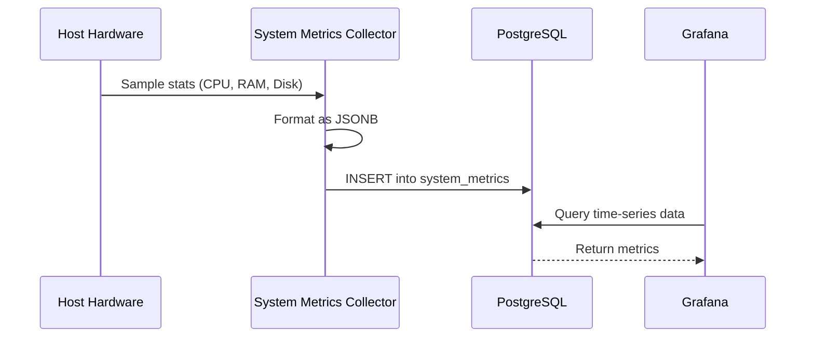

# System Metrics Collector Architecture

The System Metrics Collector (`services/system-metrics/`) is a lightweight agent designed to monitor the host infrastructure's health.

## Component Details

- **Runtime**: Go (compiled binary).
- **Library**: `gopsutil` for cross-platform hardware statistics.
- **Infrastructure**: Uses the **Standard PostgresWrapper** (`pkg/db`) for persistent storage and schema management.
- **Target**: Pushes data directly to the `system_metrics` table in PostgreSQL (TimescaleDB).

### Metrics Collected

- **CPU**: Usage percentage.
- **Memory**: Total, used, and available RAM.
- **Disk**: IOPS and usage stats.
- **Network**: Bandwidth usage (bytes sent/received).
- **Resource Saturation**: Advanced **Observable Gauge** tracking unified CPU and Memory pressure.

## Data Flow: Metrics Collection

