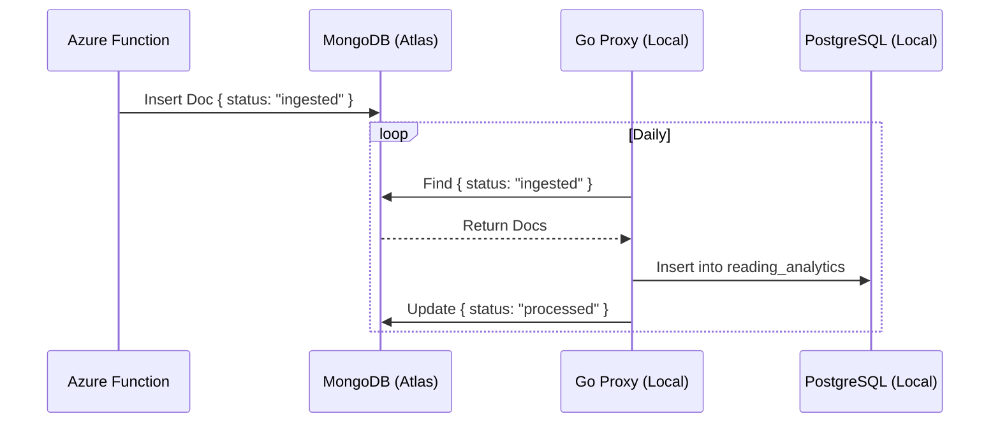

# ADR 002: Cloud-to-Homelab Telemetry Bridge

- **Status:** Accepted
- **Date:** 2025-12-01
- **Author:** Victoria Cheng

## Context and Problem Statement

Telemetry generated in Azure Functions (Cover Craft / Reading App) needs to be visualized in the local Grafana instance.

**Constraint:** The local environment is behind a residential firewall (NAT). Inbound HTTP connections from Azure are restricted for security reasons. The goal is to avoid the complexity of maintaining a VPN for a single-purpose logging use case.

## Decision Outcome

Use a shared **MongoDB** instance (Atlas) as an intermediate "Buffer" or Store-and-Forward node (The "Pull Model").

- **Producer (Azure):** The Azure Function writes event logs to MongoDB with `status: "ingested"`.
- **Consumer (Local Go Proxy):** A local service polls MongoDB once per day.
- **Processing:** The Go service downloads new logs, saves them to the local PostgreSQL (the Single Source of Truth), and updates the MongoDB document to `status: "processed"`.

### Diagram

## Consequences

### Positive

- **Security:** Secure (Outbound only), no need to expose home network.
- **Cost:** Uses Free Tier of MongoDB Atlas.
- **Simplicity:** Simple implementation compared to VPN/Tailscale.

### Negative/Trade-offs

- **Latency:** Polling introduces slight latency (not real-time).
- **Dependency:** Adds dependency on external MongoDB availability.

## Verification

- [x] **Manual Check:** Verify new records appear in Postgres after daily sync.
- [x] **Automated Tests:** `proxy/utils/reading_test.go` integration tests.
