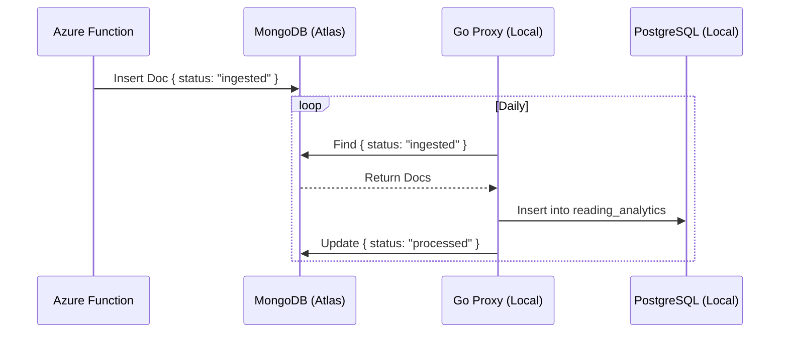

# RFC 002: Cloud-to-Homelab Telemetry Bridge

**Status:** Implemented  
**Date:** Dec 2025  
**Author:** Victoria Cheng

## 1. The Problem

Telemetry generated in Azure Functions (Cover Craft / Reading App) needs to be visualized in the local Grafana instance.

**Constraint:** The local environment is behind a residential firewall (NAT). Inbound HTTP connections from Azure are restricted for security reasons. The goal is to avoid the complexity of maintaining a VPN for a single-purpose logging use case.

## 2. Proposed Solution (The "Pull Model")

Use a shared **MongoDB** instance (Atlas) as an intermediate "Buffer" or Store-and-Forward node.

1. **Producer (Azure):** The Azure Function writes event logs to MongoDB with `status: "ingested"`.
2. **Consumer (Local Go Proxy):** A local service polls MongoDB once per day.
3. **Processing:** The Go service downloads new logs, saves them to the local PostgreSQL (the Single Source of Truth), and updates the MongoDB document to `status: "processed"`.

### Diagram

## 3. Alternatives Considered

| Alternative | Pros | Cons | Decision |
| :--- | :--- | :--- | :--- |
| **VPN / Tailscale** | Direct secure connection. | High operational complexity for a simple logging use case. | Rejected |
| **Port Forwarding** | Free, easy to setup. | **Security Risk.** Exposes home network to the public internet. | Rejected |
| **MongoDB Bridge** | Secure (Outbound only), Free tier, simple implementation. | Polling introduces slight latency (not real-time). | **Accepted** |

## 4. Implementation Details

The synchronization logic is handled by the `proxy/utils/reading.go` service. It follows a **Fetch -> Insert -> Acknowledge** transaction pattern to ensure data consistency.
