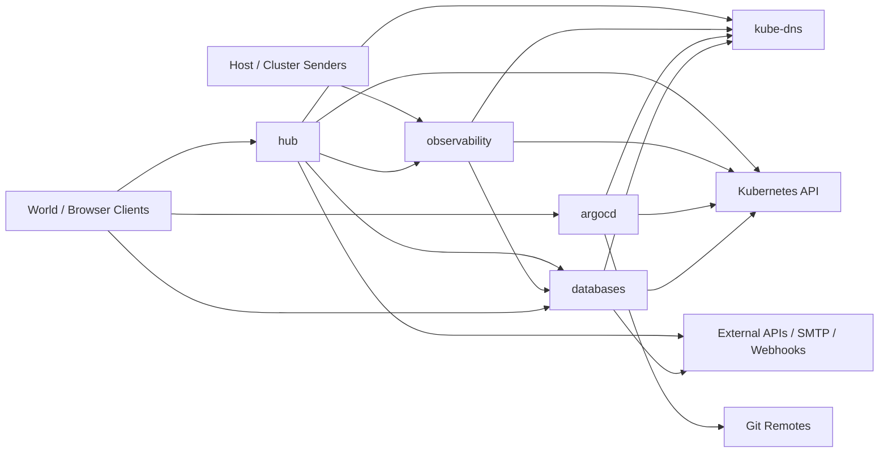

# Network Flow Baseline

This note is the current reference for known network dependencies in the cluster.

It is intended to support:

- Cilium policy reviews
- rollout validation after policy changes
- future hardening work that replaces broad allow rules with narrower ones

This is not a full traffic inventory yet. It is a baseline built from current manifests, service configuration, and active Cilium policies.

## High-Level Flow Map

This diagram is intentionally coarse. It shows namespace and external flow relationships, not service-level detail.

## How To Use This File

Each row answers five questions:

- who initiates the connection
- what service it reaches
- which port and protocol are required
- why the path exists
- whether the path is explicitly represented in current policy

If a path is required by application configuration but is broader in policy than shown here, treat that as a documentation gap or future hardening candidate.

## Critical In-Cluster Flows

| Source | Destination | Port / Protocol | Purpose | Current Policy State |
| :--- | :--- | :--- | :--- | :--- |
| `hub/grafana` | `observability/prometheus-server` | `80/TCP` service to Prometheus | Metrics queries and dashboards | Explicitly allowed by `hub-security` |
| `hub/grafana` | `observability/loki-gateway` | `80/TCP` service to Loki gateway | Log queries | Explicitly allowed by `hub-security` |
| `hub/grafana` | `observability/tempo` | `3200/TCP` | Trace queries | Explicitly allowed by `hub-security` |
| `hub/grafana` | `databases/postgres-hub-rw` | `5432/TCP` | PostgreSQL datasource | Explicitly allowed by `hub-security` |
| `hub/n8n` | `databases/postgres-hub-rw` | `5432/TCP` | Workflow state and application DB | Explicitly allowed by `hub-security` |
| `hub` workloads | `databases/minio` | `9000/TCP` | S3-style storage access if needed from hub apps | Broadly allowed by `hub-security`; app-level use should be confirmed |
| `observability/opentelemetry` | `observability/tempo` | `4317/TCP` | OTLP trace export | Allowed by `observability-core` |
| `observability/opentelemetry` | `observability/loki` | `3100/TCP` | Log export | Allowed by `observability-core` |
| `observability/opentelemetry` | `observability/prometheus-server` | `80/TCP` service to `/api/v1/write` | Remote write for metrics | Reaches Prometheus service; validate whether port `80` is sufficiently represented in policy intent |
| `observability/tempo` | `databases/minio` | `9000/TCP` | Trace block storage | Allowed across namespace boundary by `databases-core` |
| `observability/tempo` | `observability/prometheus-server` | `80/TCP` service to `/api/v1/write` | Metrics generator remote write | Reaches Prometheus service; validate whether port `80` is sufficiently represented in policy intent |
| `observability/loki` | `databases/minio` | `9000/TCP` | Log chunk and ruler object storage | Allowed across namespace boundary by `databases-core` |
| `observability/prometheus + thanos-sidecar` | `databases/minio` | object store via Thanos config | Long-term metrics block storage | Allowed across namespace boundary by `databases-core` |
| `argocd` components | `argocd` components | `80,443,6379,7000,8080,8081/TCP` | Internal control-plane communication | Explicitly allowed by `argocd-security` |
| `databases` components | `databases` components | `5432,8000,9000,9001/TCP` | Postgres and MinIO internal flows | Explicitly allowed by `databases-core` |

## Platform Dependency Flows

These paths are foundational and should be validated after any network policy change.

| Source Scope | Destination | Port / Protocol | Purpose | Current Policy State |
| :--- | :--- | :--- | :--- | :--- |
| protected workloads | `kube-system/kube-dns` | `53/UDP` | DNS resolution | Explicitly allowed where policies enforce egress |
| protected workloads | Kubernetes API | `443/TCP`, `6443/TCP`, `10250/TCP` | API access, control-plane communication, node access patterns | Explicitly allowed where policies enforce egress |
| cluster and host senders | observability services | service-specific TCP ports | Telemetry ingestion and scraping | Allowed by `observability-core` |

## External Egress Baseline

These paths exist today, but some are broader in policy than the desired long-term state.

| Source | Destination | Port / Protocol | Purpose | Current Policy State |
| :--- | :--- | :--- | :--- | :--- |
| `argocd` | `github.com`, `gitlab.com`, related subdomains | `22/TCP`, `443/TCP`, `9418/TCP` | Repository sync | Explicitly scoped by `argocd-security` |
| `hub/n8n` | external APIs and webhook destinations | `25/TCP`, `80/TCP`, `443/TCP`, `465/TCP`, `587/TCP` | Integrations, outbound webhooks, email | Broad wildcard FQDN egress in `hub-security` |
| `databases/postgres` | Azure Blob Storage | `443/TCP` | Database backups | Requires egress to Azure storage endpoints |

## External Ingress Surfaces

These are intentionally exposed today and should be part of every validation pass.

| Destination | Port / Protocol | Purpose | Current Policy State |
| :--- | :--- | :--- | :--- |
| `hub/grafana` | `3000/TCP` and service `80/TCP` | UI access | Allowed from `world` by `hub-security` |
| `hub/n8n` | `5678/TCP` and service `80/TCP` | UI and webhook endpoint | Allowed from `world` by `hub-security` |
| `hub/ollama` | `11434/TCP` | model endpoint | Allowed from `world` by `hub-security` |
| `argocd/server` | `80/TCP`, `443/TCP`, `8080/TCP` | GitOps UI and API access | Allowed from `world` by `argocd-security` |
| `databases/postgres` | `5432/TCP` | Database access | Currently allowed from broad entities by `databases-core`; review whether this should remain externally reachable |
| `databases/minio` | `9000/TCP`, `9001/TCP` | S3 API and console | Currently allowed from broad entities by `databases-core`; review whether this should remain externally reachable |

## Gaps To Confirm

These items should be verified against live traffic before any tightening work:

- which exact external domains n8n needs
- whether any hub workload besides Grafana and n8n needs MinIO access
- whether any observability service-port dependencies remain documented by container port instead of service port
- whether `hardware-sim` needs its own namespace policy and baseline entries

## Update Rules

Update this file when:

- a new namespace gets an explicit Cilium policy
- a workload gains or loses an external dependency
- a datasource or storage backend changes
- a policy hardening change narrows an existing broad rule

If a policy change cannot be mapped back to a row in this file, the change probably needs more documentation before rollout.
