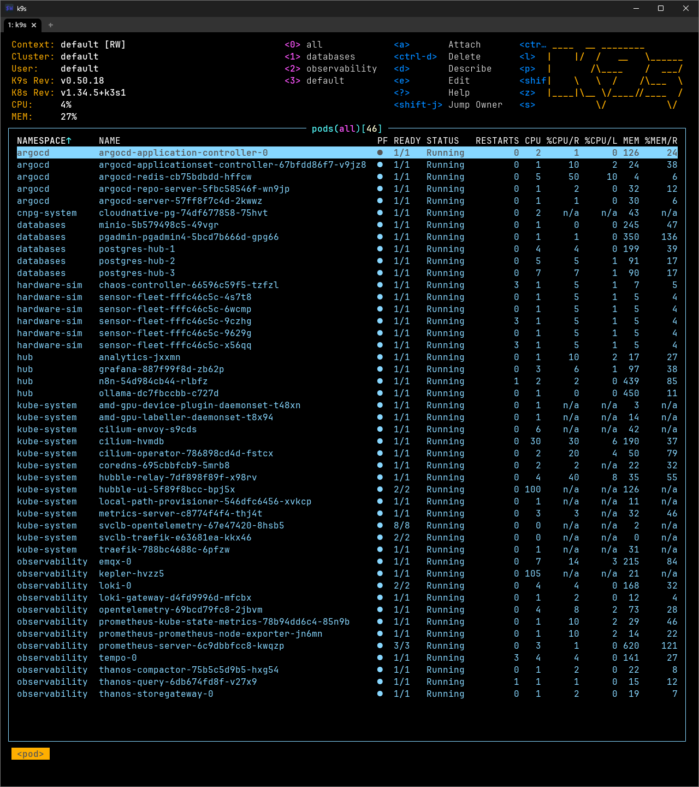
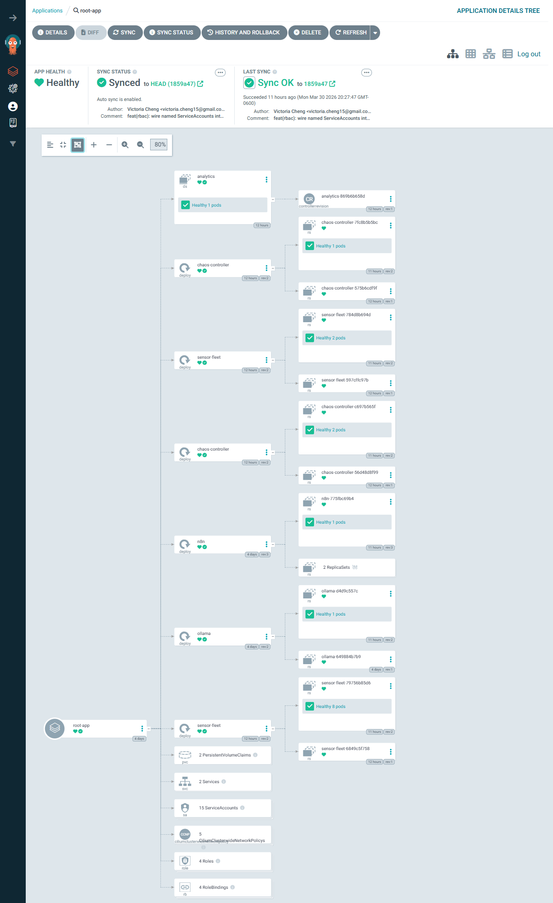
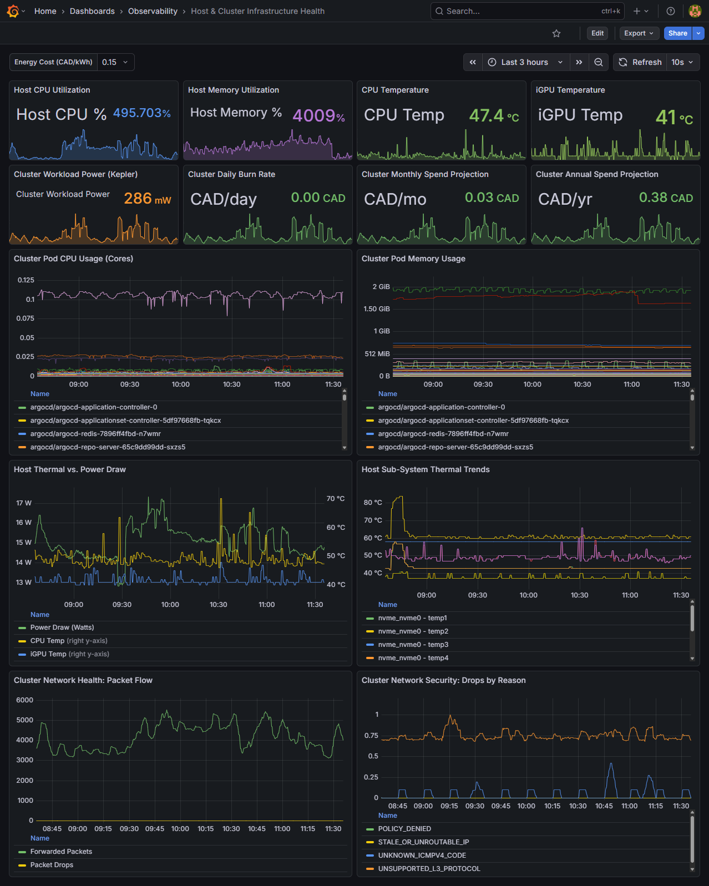
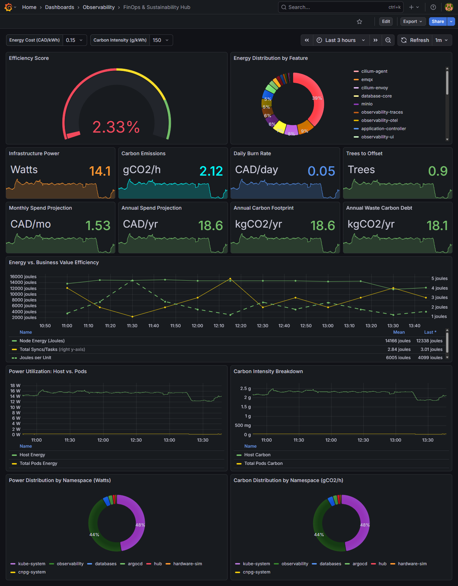
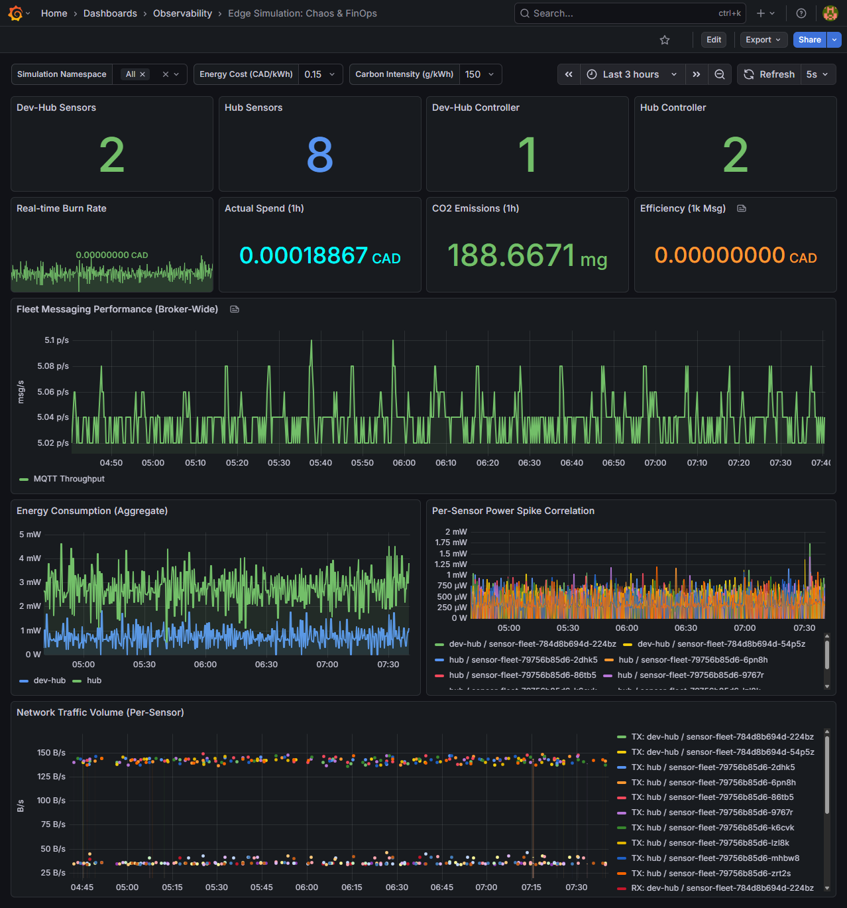
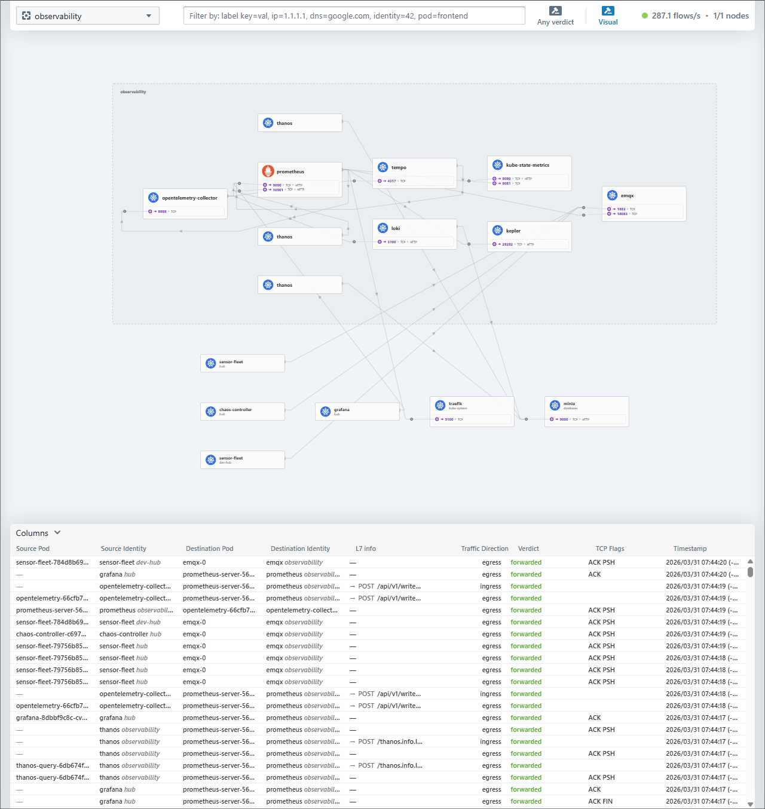

# Visual Showcase & Infrastructure Dashboards

This directory serves as the visual gallery for the **Observability Hub**. It showcases the real-time monitoring, network flows, and GitOps orchestration that power the infrastructure running on the local Mini PC lab.

## 🛠️ Cluster Operations & Introspection

### k9s: Live Workloads

The "Ground Truth" for the entire platform. This view provides real-time, terminal-level introspection into the K3s namespaces, showing the healthy, reconciled state of the LGTM stack, Cilium networking, and host-tier services running on the Mini PC.

## 🚀 GitOps & Orchestration

### ArgoCD UI

The control plane for declarative infrastructure. Shows the 'App-of-Apps' pattern in action, reconciling the state of the K3s cluster against the Git repository.

## 📊 Observability Dashboards (LGTM Stack)

### Infrastructure & Host Health

Detailed Grafana dashboard tracking CPU/Memory pressure, disk I/O, and temperature of the Mini PC host. Bridges the gap between hardware sensors and Kubernetes metrics.

### FinOps & Sustainability

Powered by **Kepler (eBPF)**. This dashboard correlates workload energy consumption (Joules/Watts) with performance, providing a high-fidelity FinOps baseline for the entire cluster.

### Chaos Engineering Sensors

Visualization of real-time telemetry from the simulation fleet. This dashboard tracks the impact of chaos experiments on system reliability and sensor accuracy.

## 🌐 Network Flow & Security

### Hubble UI (Cilium eBPF)

Sidecar-less networking visibility. Shows the service map, protocol-level interactions (L3/L4/L7), and security policy enforcement across the cluster.

---

## 🔗 Navigation

- [Back to Documentation](../README.md)
- [Back to Main README](../../README.md)
