# Visual Showcase & Infrastructure Dashboards

This directory serves as the visual gallery for the **Observability Hub**. It showcases the real-time monitoring, network flows, and GitOps orchestration that power the infrastructure running on the local Mini PC lab.

All screenshots are captured from live services in the homelab environment, not static mockups or diagrams.

## 🛠️ Cluster Operations & Introspection

### k9s: Live Workloads

The "Ground Truth" for the entire platform. This view provides real-time, terminal-level introspection into the K3s namespaces, showing the healthy, reconciled state of the LGTM stack, Cilium networking, and host-tier services running on the Mini PC.

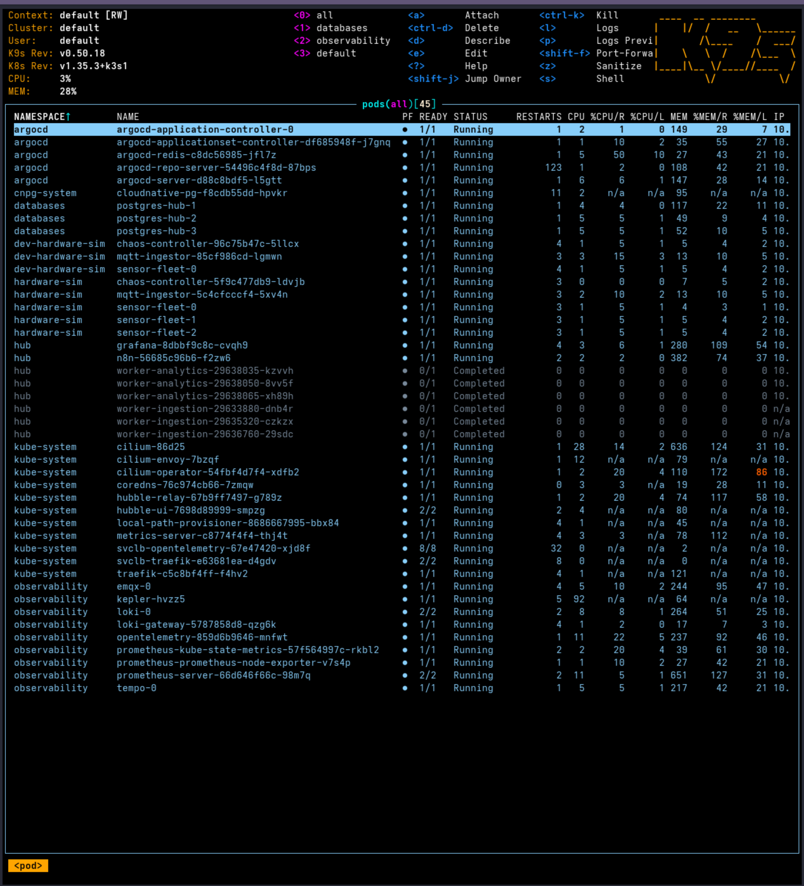

## 🚀 GitOps & Orchestration

These views demonstrate single-control-plane GitOps across this repository and an external hardware lab repository, with separate development and production reconciliation targets.

### ArgoCD UI

The control plane for declarative infrastructure. Shows the 'App-of-Apps' pattern in action, reconciling the state of the K3s cluster against the Git repository.

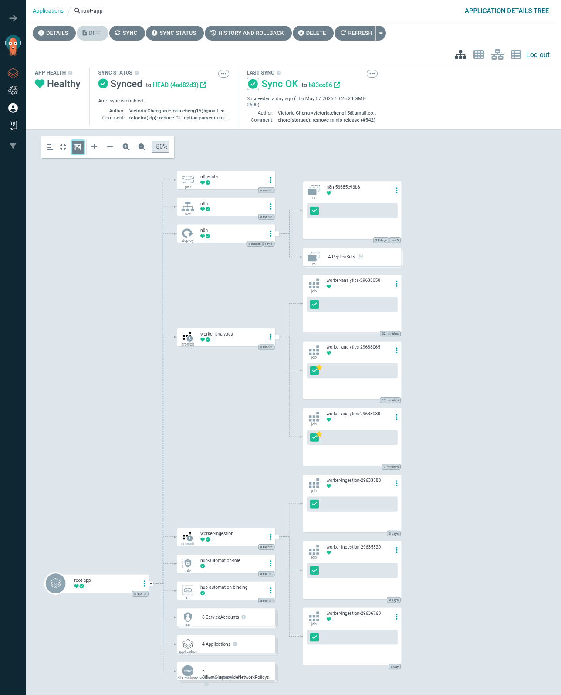

### Hardware Lab Production

Production `hw-lab` application state in ArgoCD. This screenshot demonstrates cross-repository GitOps: ArgoCD reconciles an application sourced from a separate hardware lab repository while keeping production state visible from the Observability Hub control plane.

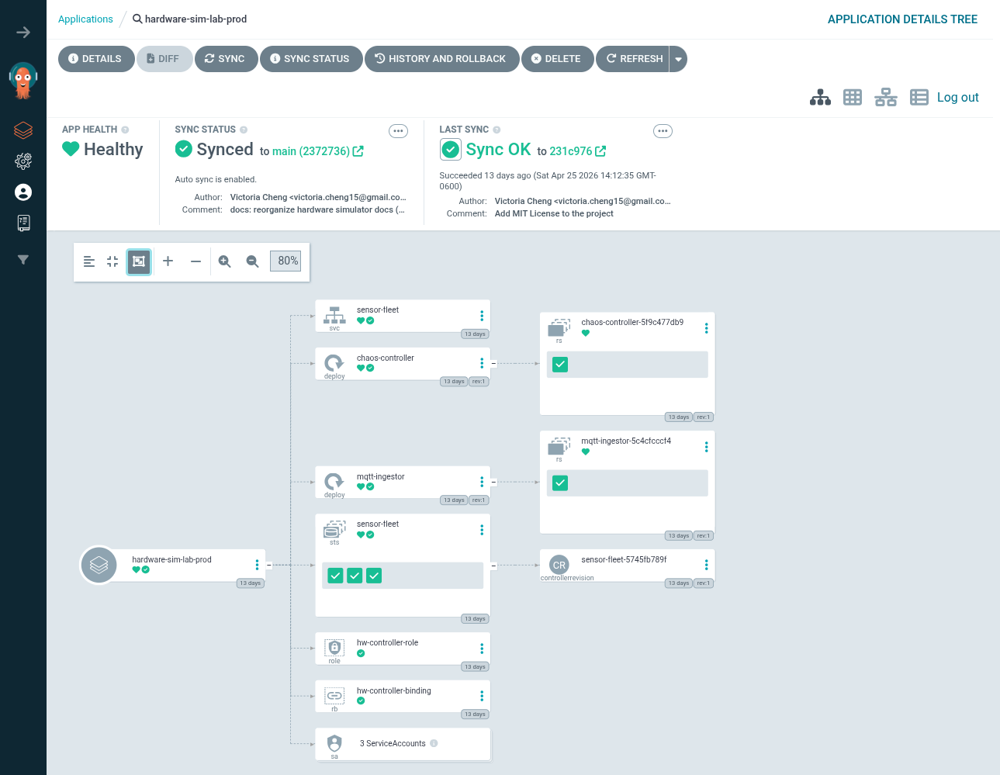

### Hardware Lab Development

Development `hw-lab` application state in ArgoCD. This view pairs with production to show the dev/prod environment split and validates that the same external repository can be promoted through separate GitOps targets.

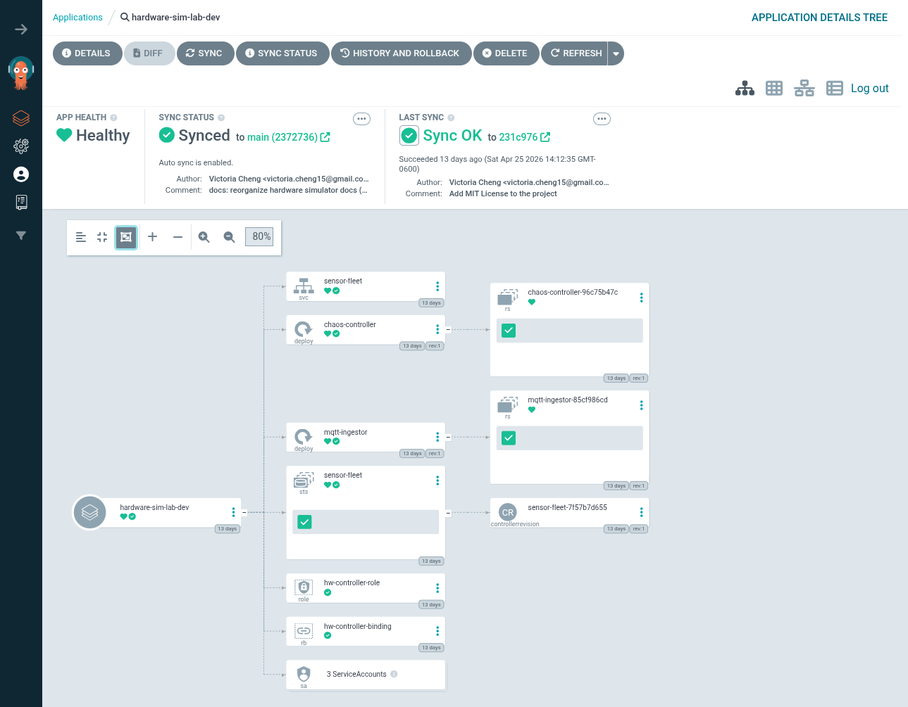

### CloudNativePG Operator

ArgoCD-managed deployment view for the CloudNativePG operator. This shows the database control plane reconciled as part of the cluster's declarative GitOps state.

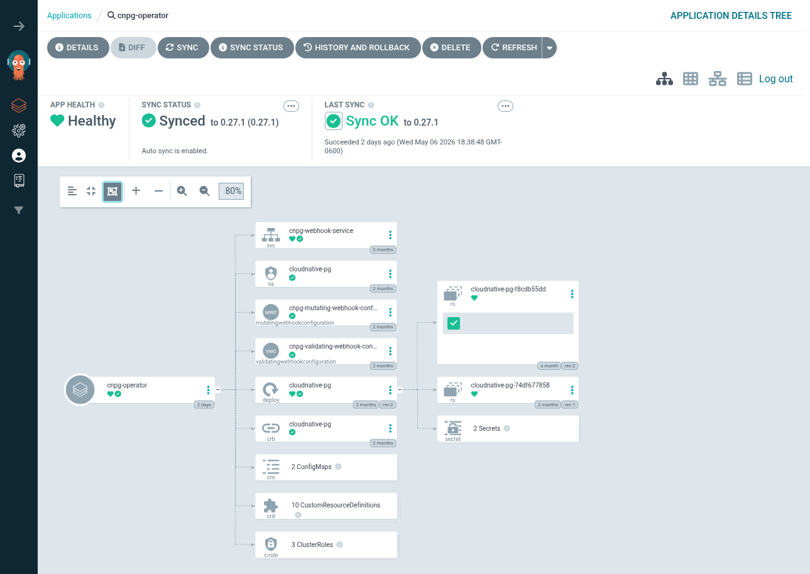

### CloudNativePG Database

Application view for the CloudNativePG database resources. Captures the reconciled Postgres layer that backs platform services requiring persistent state.

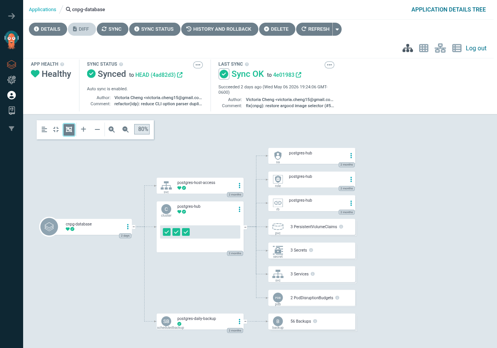

### Cilium Policies (ArgoCD Managed)

Declarative management of eBPF-based security policies. ArgoCD ensures that the L3-L7 Cilium Network Policies are synchronized with the cluster's intended security posture.

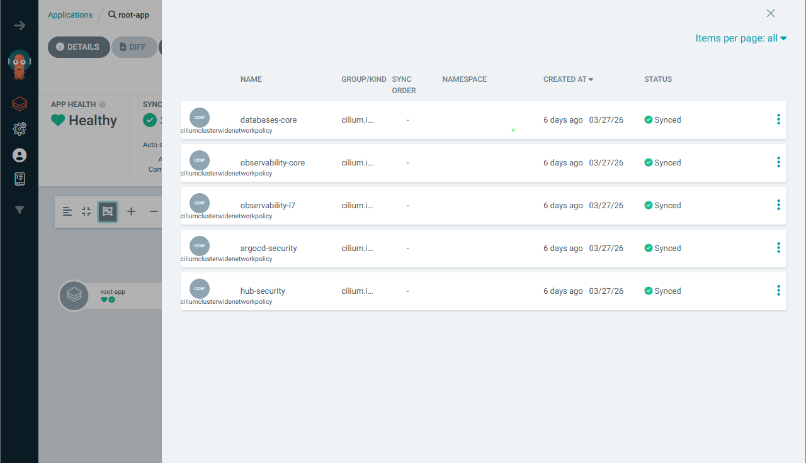

### RBAC & Service Accounts

Identity and Access Management (IAM) for the cluster. This view showcases the reconciled state of ServiceAccounts and RBAC bindings across all observability namespaces.

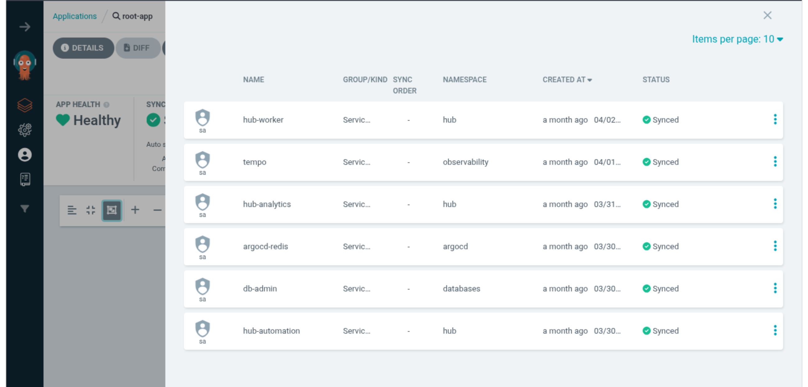

## 📊 Observability Dashboards (LGTM Stack)

### Infrastructure & Host Health

Detailed Grafana dashboard tracking CPU/Memory pressure, disk I/O, and temperature of the Mini PC host. Bridges the gap between hardware sensors and Kubernetes metrics.

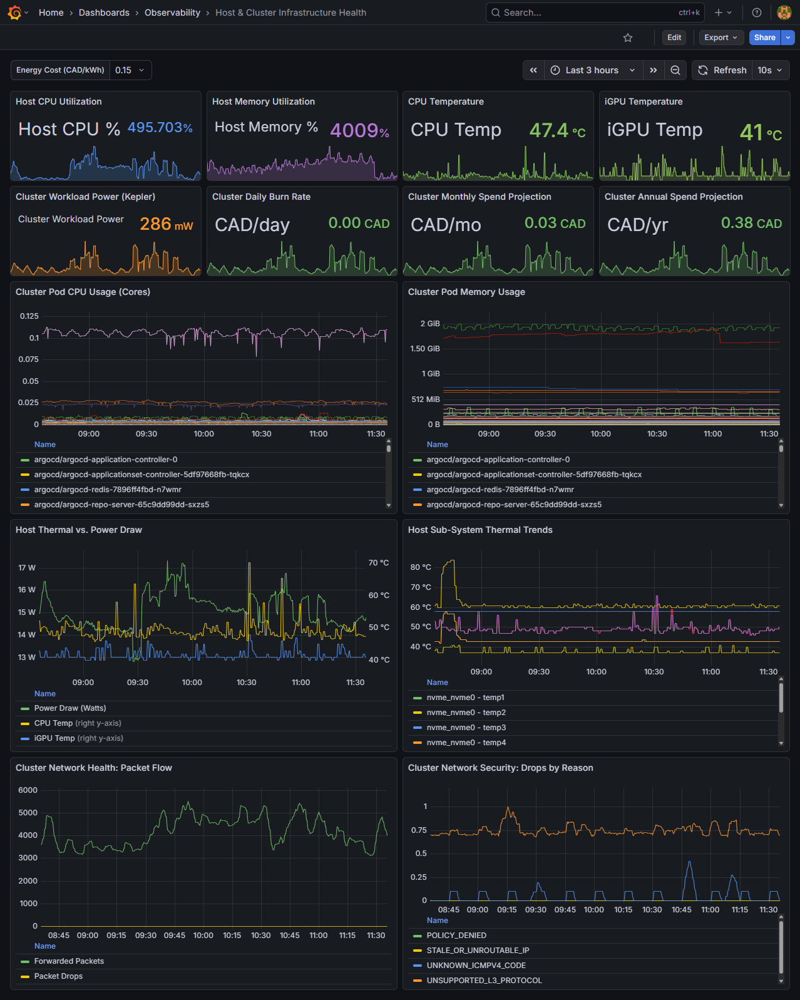

### FinOps & Sustainability

Powered by **Kepler (eBPF)**. This dashboard correlates workload energy consumption (Joules/Watts) with performance, providing a high-fidelity FinOps baseline for the entire cluster.

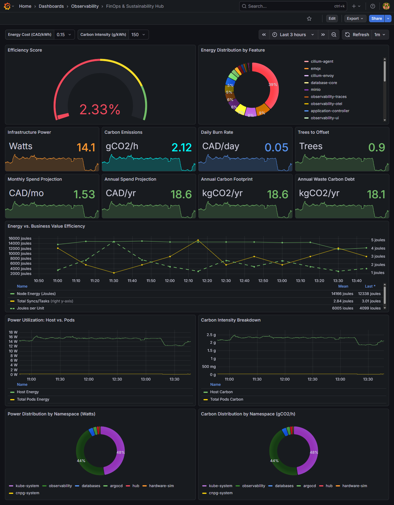

### Chaos Engineering Sensors

Visualization of real-time telemetry from the simulation fleet. This dashboard tracks the impact of chaos experiments on system reliability and sensor accuracy.

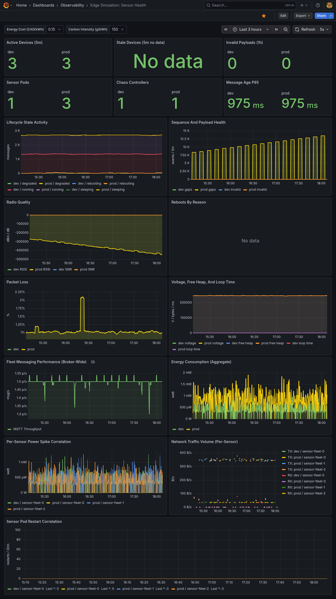

### Cilium & Hubble Health

Grafana dashboard for network observability health. This view proves that Cilium and Hubble metrics are being collected, scraped, and visualized as part of the platform's operational telemetry stack.

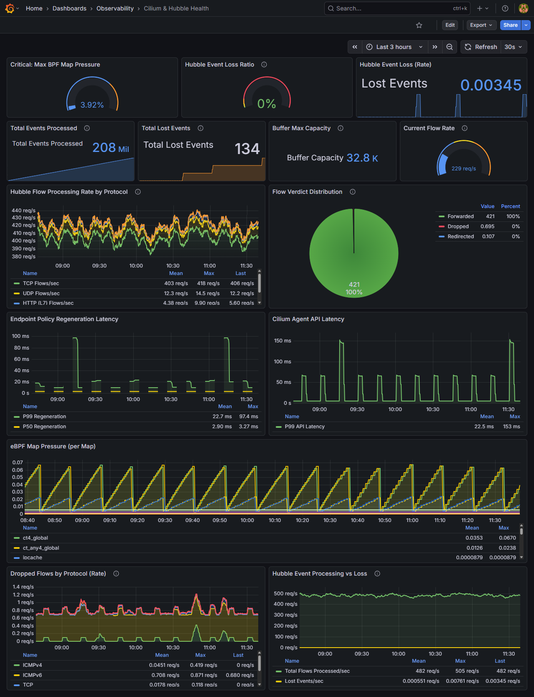

## 🌐 Network Flow & Security

### Hubble UI (Cilium eBPF)

Sidecar-less networking visibility. Shows the service map, protocol-level interactions (L3/L4/L7), and security policy enforcement across the cluster.

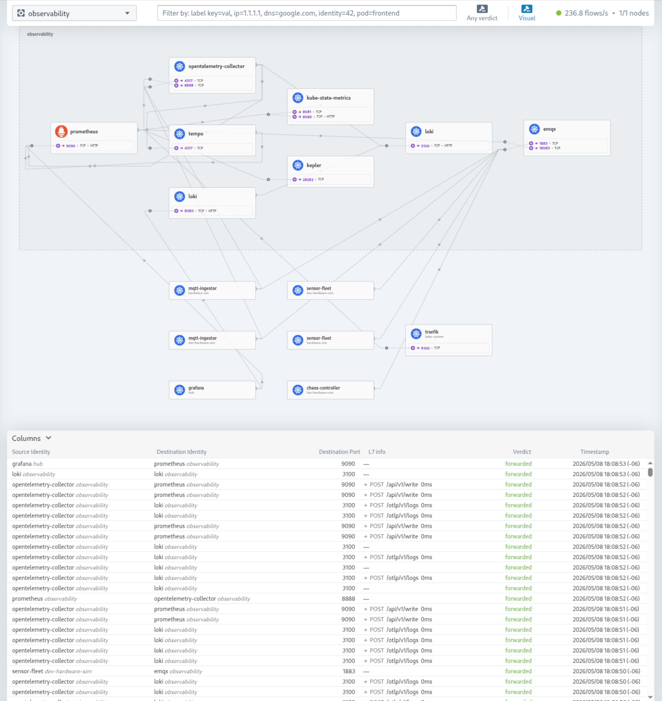

### Hubble: Hub Domain Interactions

Detailed view of traffic flows within the `hub` namespace. This captures the communication between analytical services and the core observability stack.

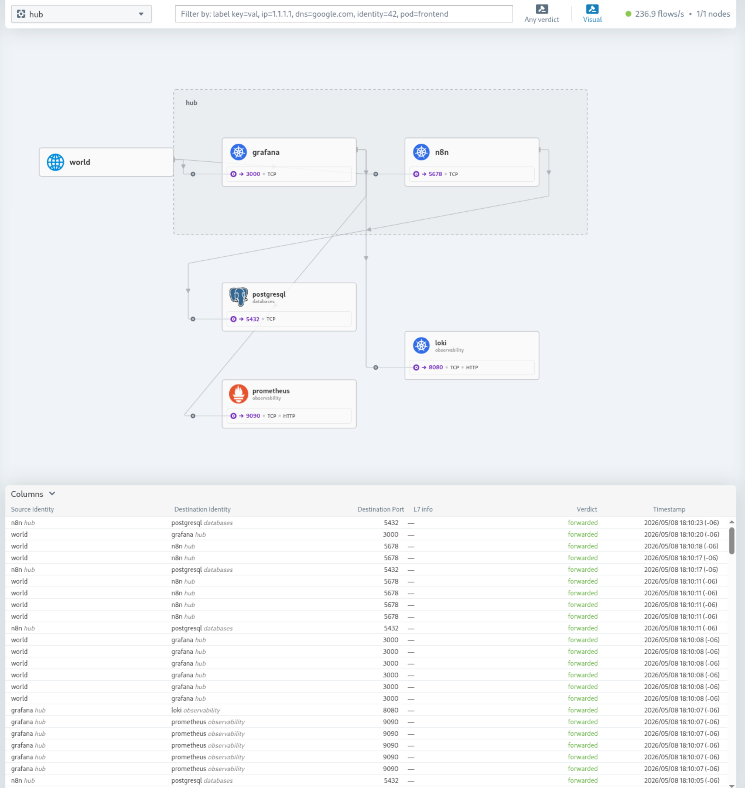

---

## 🔗 Navigation

- [Back to Documentation](../README.md)
- [Back to Main README](../../README.md)
